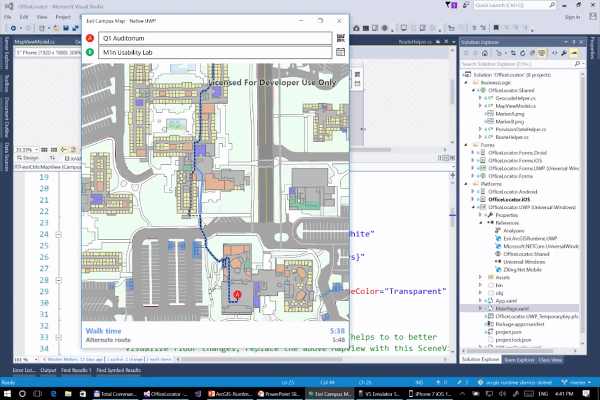

> **Note**: this project is hosted on a [public repository](https://github.com/hhkaos/awesome-arcgis) where anyone can contribute. Learn how to [contribute in less than a minute](https://github.com/hhkaos/awesome-arcgis/blob/master/CONTRIBUTING.md#contributions).

# .NET Developers

On this page you will find resources to learn how to develop desktop applications using [the ArcGIS Runtime SDK for .NET](https://developers.arcgis.com/net/latest). See the following pages if you are looking for resources to learn: [how extend ArcGIS Pro using .Net](../../../arcgis/products/arcgis-desktop/arcgis-pro/README.md) or [using Xamarin to develop mobile applications using .NET](../../../mobile/technologies/xamarin/README.md)

 

<!-- START doctoc generated TOC please keep comment here to allow auto update -->
<!-- DON'T EDIT THIS SECTION, INSTEAD RE-RUN doctoc TO UPDATE -->
**Table of contents**

- [Introduction](#introduction)
- [Training](#training)
  - [Documentation](#documentation)
  - [Tutorials](#tutorials)
  - [Videos](#videos)
  - [Slides](#slides)
- [Download the Runtime SDK for .NET](#download-the-runtime-sdk-for-net)
- [Coding](#coding)
  - [Code](#code)
  - [Tools](#tools)
- [Awesome projects & cool demos](#awesome-projects--cool-demos)
- [Support and Community](#support-and-community)
- [People you should know](#people-you-should-know)
- [News](#news)
- [Additional resources](#additional-resources)
  - [Localized resources](#localized-resources)
    - [Spanish](#spanish)
- [Awesome lists for .NET](#awesome-lists-for-net)

<!-- END doctoc generated TOC please keep comment here to allow auto update -->

## Introduction

[ArcGIS Runtime SDK for .NET Official Documentation](https://developers.arcgis.com/net/latest/)

ArcGIS Runtime SDK for .NET contains APIs (for [WPF](https://developers.arcgis.com/net/latest/wpf/guide/display-a-map.htm), [UWP](https://developers.arcgis.com/net/latest/uwp/guide/display-a-map.htm), ...) that enable you to build native mapping apps and share source code across Windows, Android, and iOS. Integrate a range of mapping and GIS capabilities online or offline, including 2D and 3D data visualization, web and mobile maps, editing, geocoding, routing, and spatial analysis.

If you are considering to make an application or prototype as fast as possible (without writing any code), in this case you should also consider using some of [our app builders, like AppStudio or Survey123](../../../arcgis/products/README.md#app-builders).

## Training

### Documentation

* [Official documentation](https://developers.arcgis.com/net/latest/)
* [Official training](www.esri.com/training/Bookmark/PKEDPSDGS)

|API|Guide|API Reference|
|---|---|---|
|Windows Presentation Framework|[WPF Guide](https://developers.arcgis.com/net/latest/wpf/guide/guide-home.htm)|[WPF reference](https://developers.arcgis.com/net/latest/wpf/api-reference/)
|Universal Windows Platform|[UWP Guide](https://developers.arcgis.com/net/latest/uwp/guide/guide-home.htm)|[UWP reference](https://developers.arcgis.com/net/latest/uwp/api-reference/)

Important concepts:

* Mobile map package - [Android](https://developers.arcgis.com/net/latest/android/guide/display-a-map.htm#ESRI_SECTION2_4CCB74E11EE04611849F3C0F41D9381C), [iOS](https://developers.arcgis.com/net/latest/ios/guide/display-a-map.htm#ESRI_SECTION2_4CCB74E11EE04611849F3C0F41D9381C) & [Forms](https://developers.arcgis.com/net/latest/forms/guide/display-a-map.htm#ESRI_SECTION2_4CCB74E11EE04611849F3C0F41D9381C): is a file object (.mmpk) created in ArcGIS Pro. It is a transport mechanism for maps, their layers, data, networks, and locators. A mobile map package can be sideloaded onto a device by email, or by platform-specific transfer mechanism, or it can be downloaded from a portal to the device. It available for applications developed using ArcGIS Runtime SDK starting with version 100.0.

### Tutorials

Less than 20 minutes tutorials: [.NET DevLabs](https://developers.arcgis.com/laxbs/browse/?topic=any&product=NET)

### Videos

Check [Esri Geodev - .NET playlist](https://www.youtube.com/playlist?list=PL0VMTWv3XRwUKOtoUlZg8QRHG55gS_Rq4)

On [*video.esri.com*](https://www.esri.com/videos/search?q=.NET#?sortby=recent) you will find and [Esri Events](https://www.youtube.com/channel/UC_yE3TatdZKAXvt_TzGJ6mw/search?query=.NET) you will find many technical talks (some of them are **Runtime generic**).

|Event|Title|Length|
|---|---|---|
|[DevSummit](http://www.esri.com/events/devsummit) 2017|[ArcGIS Runtime: Building Cross-platform Apps](https://www.youtube.com/watch?v=XLT1PjZgbAQ)|59min 08secs|
|[DevSummit](http://www.esri.com/events/devsummit) 2017|[ArcGIS Runtime SDK for .NET: Building Apps](https://www.youtube.com/watch?v=_KBcHw9HZ50)|1h 01min 23sec|
|[DevSummit](http://www.esri.com/events/devsummit) 2017|[ArcGIS Runtime: Migrating from ArcGIS Engine](https://www.youtube.com/watch?v=h1lyaH00G6A)| 1h 10min 32secs
|[DevSummit](http://www.esri.com/events/devsummit) 2016|[ArcGIS Runtime SDK for .NET: Tips and Tricks](https://www.esri.com/videos/watch?videoid=5064&channelid=LegacyVideo&isLegacy=true&title=arcgis-runtime-sdk-for-.net:-tips-and-tricks)|58min 18secs|
|[DevSummit](http://www.esri.com/events/devsummit) 2015|[Developing Windows Desktop and Device Apps with the ArcGIS Runtime SDK for .NET](https://www.esri.com/videos/watch?videoid=4733&channelid=LegacyVideo&isLegacy=true&title=developing-windows-desktop-and-device-apps-with-the-arcgis-runtime-sdk-for-.net)|1h 06min 59secs|
|[DevSummit](http://www.esri.com/events/devsummit) 2015|[ArcGIS Runtime SDK for .NET: Integrating Devices, Sensors, Services, and More](https://www.esri.com/videos/watch?videoid=4448&channelid=LegacyVideo&isLegacy=true&title=arcgis-runtime-sdk-for-.net:-integrating-devices,-sensors,-services,-and-more)|56min 21secs
|[DevSummit](http://www.esri.com/events/devsummit) 2015|[ArcGIS Runtime SDK for .NET: How We Built the Plenary Apps](https://www.esri.com/videos/watch?videoid=4449&channelid=LegacyVideo&isLegacy=true&title=arcgis-runtime-sdk-for-.net:-how-we-built-the-plenary-apps)|40min 52secs|
|[DevSummit](http://www.esri.com/events/devsummit) 2015|[ArcGIS Runtime SDK for .NET: Transitioning to It from Other Esri .NET SDKs](https://www.esri.com/videos/watch?videoid=4413&channelid=LegacyVideo&isLegacy=true&title=arcgis-runtime-sdk-for-.net:-transitioning-to-it-from-other-esri-.net-sdks)|1h 3min 17secs|
|[DevSummit](http://www.esri.com/events/devsummit) 2015|[Geo-Enable Your .NET Apps with ArcGIS Online and Runtime](https://www.esri.com/videos/watch?videoid=4415&channelid=LegacyVideo&isLegacy=true&title=geo-enable-your-.net-apps-with-arcgis-online-and-runtime)|59min 50secs|

> You might also find interesting videos at [Esri Industries](https://www.youtube.com/channel/UCZTiOg3n0pqUDSatq7mS2PA), [ArcGIS](https://www.youtube.com/channel/UCgGDPs8cte-VLJbgpaK4GPw), [etc](https://esri-es.github.io/awesome-arcgis/esri/#youtube-channels)

### Slides

More slides in [*proceedings.esri.com*](https://www.google.es/search?q=site%3Aproceedings.esri.com+.NET+-"ArcGIS+Pro") or check on [geonet](https://community.esri.com/content?query=ArcGIS+Runtime+SDK+for+.NET&filterID=all~objecttype~objecttype%5Bdocument%5D).

## Download the Runtime SDK for .NET

You first need and [ArcGIS Developer Subscription](https://developers.arcgis.com/pricing/), then you will be able to [download it from here](https://developers.arcgis.com/downloads/apis-and-sdks) or follow the following [installation guide](https://developers.arcgis.com/net/latest/wpf/guide/install-the-sdk.htm).

## Coding

### Code

* Developer site:
    * [Documentation code samples code](https://developers.arcgis.com/net/latest/)
    * Example app: [Maps App .NET](https://developers.arcgis.com/example-apps/maps-app-dotnet/)
* Github:
    * [arcgis-runtime-samples-dotnet: Sample code for ArcGIS Runtime SDK for .NET – UWP, WPF, Xamarin.Android, Xamarin.iOS, and Xamarin.Forms](https://github.com/Esri/arcgis-runtime-samples-dotnet)
    * [Other Esri Open Sourced .NET Samples ](https://github.com/Esri?utf8=%E2%9C%93&q=dotnet&type=&language=)
    * [.NET samples at developer-support repo](https://github.com/Esri/developer-support/tree/master/runtime-net)
    * [ArcGISRestAPI - A .NET library for interfacing with the ArcGIS REST API - for developing with ArcGIS Online and Portal for ArcGIS](https://github.com/EsriUK/ArcGISRestAPI)
    * ArcGIS Online:
        * [ArcGISRuntimeSDK items](https://www.arcgis.com/home/search.html?q=owner%3AArcGISRuntimeSDK&restrict=false&start=1&sortOrder=desc&sortField=modified)
        * [ArcGIS Code Sharing](http://codesharing.arcgis.com/)
    * [More at .NET @ ArcGIS Search](https://esri-es.github.io/arcgis-search/?search=.NET+site%3Agithub.com%20-arcobjects&utm_campaign=awesome-list&utm_source=awesome-list&utm_medium=page)

### Tools

Additional tools to help you speedup your developments:

* [Toolkit for ArcGIS Runtime SDK for .NET](https://github.com/Esri/arcgis-toolkit-dotnet)

## Awesome projects & cool demos

[ArcGIS Runtime SDK for .Net Demo at 2017 DevSummit Plenary](https://youtu.be/i8FgR_3zumQ?t=39m59s)

## Support and Community

If needed, remember you can always check the [Technical Support Website for developer products](https://support.esri.com/en/Products/Developers) and the [Technical Support Blog at GeoNet](https://community.esri.com/groups/technical-support/blog/tags#/) to find additional resources.

**Community channels:**

* GeoNet
    * [Developers](https://community.esri.com/community/developers) > [Native App Developers](https://community.esri.com/community/developers/native-app-developers) > [ArcGIS Runtime SDK for .NET](https://community.esri.com/community/developers/native-app-developers/arcgis-runtime-sdk-for-net)
        * [ArcGIS Runtime SDK for .NET answered questions](https://community.esri.com/community/developers/native-app-developers/arcgis-runtime-sdk-for-net/content?filterID=contentstatus%5Bpublished%5D~objecttype~thread%5Bquestions%5D~thread%5Banswered%5D)
* [Stackoverflow questions: [.net] and [arcgis] or [.net] and [esri]](https://stackoverflow.com/search?q=%5B.net%5D+and+%5Barcgis%5D+or+%5B.net%5D+and+%5Besri%5D+)
* [Stackexchange](https://gis.stackexchange.com/search?q=.net)
* Sometimes is worth to combine GeoNet with the Github issues of an specific repo

If you have an idea you can also share it on [ArcGIS Ideas -> ArcGIS Runtime](https://community.esri.com/community/arcgis-ideas/content?filterID=contentstatus%5Bpublished%5D~category%5Barcgis-runtime%5D&query=.net)

## People you should know

Please find the [ArcGIS Experts on this topic using this tool](https://esri-es.github.io/arcgis-experts/?topic=ArcGIS%20Runtime%20SDK%20for%20.NET):

They don't work on the support team and some may even not work at Esri,
but they are opening some projects and sharing insights related to this
technology so we recommend you to follow them.

## News

* [News tagged as ".NET" at blogs.esri.com](https://blogs.esri.com/esri/arcgis/tag/net/)
* [".NET" at esri.com search engine](https://www.esri.com/search?filter=Blogs&q=.net&search=Search)
* [Blog Posts about ".NET" inside Places at GeoNet](https://community.esri.com/content?query=.NET&filterID=all~objecttype~objecttype%5Bblogpost%5D)
* Twitter accounts:
    * [@ArcGISRuntime](https://twitter.com/arcgisruntime)
    * [@EsriGeoDev](https://twitter.com/EsriGeoDev)

## Additional resources

* [GeoDev Webinar Series](go.esri.com/geodev)

* Probably not all the resources are in this list, please use the [ArcGIS Search](https://esri-es.github.io/arcgis-search/) tool looking for: ["ArcGIS Runtime SDK for .NET"](https://esri-es.github.io/arcgis-search/?search=%22ArcGIS%20Runtime%20SDK%20for%20.NET%22&utm_campaign=awesome-list&utm_source=awesome-list&utm_medium=page).

### Localized resources

#### Spanish

* [GeoDev Spain - Grupo de GeoNet en español](https://geonet.esri.com/groups/geodev-spain)

## Awesome lists for .NET

You will find a lot of interesting resources to learn an improve your skills
with .NET:

* [quozd/awesome-dotnet](https://github.com/quozd/awesome-dotnet): A collection of awesome .NET libraries, tools, frameworks and software
* [thangchung/awesome-dotnet-core](https://github.com/thangchung/awesome-dotnet-core): A collection of awesome .NET core libraries, tools, frameworks and software
