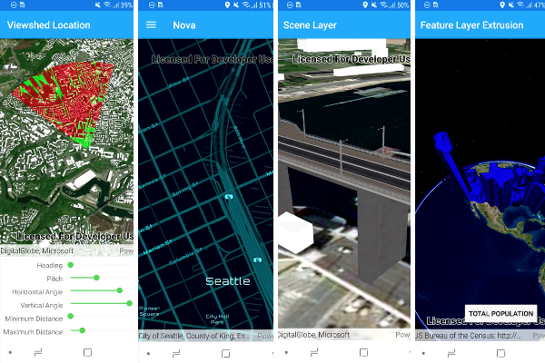

> **Note**: this page is only a draft, but this project is hosted on a [public repository](https://github.com/hhkaos/awesome-arcgis) where anyone can contribute. Learn how to [contribute in less than a minute](https://github.com/hhkaos/awesome-arcgis/blob/master/CONTRIBUTING.md#contributions).

# Android Developers

ArcGIS Runtime SDK for Android integrates a wide range of mapping and GIS capabilities online or offline, including editing, analysis, geocoding, routing, management of web maps, data visualization, mobile map packages, and vector tiled layers

 

<!-- START doctoc generated TOC please keep comment here to allow auto update -->
<!-- DON'T EDIT THIS SECTION, INSTEAD RE-RUN doctoc TO UPDATE -->
**Table of contents**

- [Introduction](#introduction)
- [Training](#training)
  - [Documentation](#documentation)
  - [Tutorials](#tutorials)
  - [Videos](#videos)
  - [Slides](#slides)
- [Download the Runtime SDK for Android](#download-the-runtime-sdk-for-android)
- [Coding](#coding)
  - [Code](#code)
  - [Tools](#tools)
- [Awesome projects & cool demos](#awesome-projects--cool-demos)
- [Support and Community](#support-and-community)
  - [People you should know](#people-you-should-know)
- [News](#news)
- [Additional resources](#additional-resources)
- [Awesome lists for Android](#awesome-lists-for-android)
  - [Localized resources](#localized-resources)
    - [Spanish](#spanish)

<!-- END doctoc generated TOC please keep comment here to allow auto update -->

## Introduction

The [ArcGIS Runtime SDK for Android](https://developers.arcgis.com/android/) is the technology you may want to use if you want to build you Android application in Java. If you are interested on building Android applications but not necessarily using this language you could also use:

* [ArcGIS Runtime SDK for .NET + Xamarin](../xamarin/README.md), using C# with Xamarin you can build application which runs on Android, iOS and Windows Phones.
* [ArcGIS Runtime SDK for Qt](../qt/README.md): using C++ & QML you can also build application for Android and iOS.

As last resource, you may even consider to make an application or prototype as fast as possible (without writing any code), in this case you should also consider using some of [our app builders, like AppStudio or Survey123](../../../arcgis/products/README.md#app-builders).

And remember, before reinventing the wheel [check the existing Esri mobile apps](../../../arcgis/mobile-apps/README.md) and consider if it make sense for you to integrate with any of the existings before doing an strong investment.

## Training

* [Android Trainings at esri.com/training](https://www.esri.com/training/Bookmark/BJ7CvLE9l)

### Documentation

* [ArcGIS Runtime SDK for Android Official Documentation](https://developers.arcgis.com/android/latest/)
    * [Android Guide](https://developers.arcgis.com/android/latest/guide/develop-your-first-map-app.htm)
    * [Android API Reference](https://developers.arcgis.com/android/latest/api-reference/reference/packages.html)

Important concepts:

  * [Mobile maps package](https://developers.arcgis.com/android/latest/guide/create-an-offline-map.htm): is a file object (.mmpk) created in ArcGIS Pro. It is a transport mechanism for maps, their layers, data, networks, and locators. A mobile map package can be sideloaded onto a device by email, or by platform-specific transfer mechanism, or it can be downloaded from a portal to the device. It available for applications developed using ArcGIS Runtime SDK starting with version 100.0.

### Tutorials

Less than 20 minutes tutorials: [Android DevLabs](https://developers.arcgis.com/labs/browse/?topic=any&product=Android)

### Videos

Check [Esri Geodev - Android playlist](https://www.youtube.com/playlist?list=PL0VMTWv3XRwXacOMrlyd2s23QiLUuI33Y)

On [*video.esri.com*](https://www.esri.com/videos/search?q=android#?sortby=recent) you will find and [Esri Events](https://www.youtube.com/channel/UC_yE3TatdZKAXvt_TzGJ6mw/search?query=android) you will find many technical talks.

|Event|Title|Length|
|---|---|---|
|[DevSummit](http://www.esri.com/events/devsummit) 2017|[ArcGIS Runtime SDK for Android: Building Applications](https://www.youtube.com/watch?v=B2HVkFXfYmU)| 52min 22secs|
|[DevSummit](http://www.esri.com/events/devsummit) 2017|[Rounding Up the EMUs App for Android](https://www.youtube.com/watch?v=CPG7DHq7Wa8)|25min 42secs|
|n.a. 2017|[Ecological Marine Unit Explorer For Android](https://www.youtube.com/watch?v=Sf6BF-P2E-E)|4min 15secs
|[DevSummit](http://www.esri.com/events/devsummit) 2016|[ArcGIS Runtime SDK for Android: Hit the Ground Running](https://www.esri.com/videos/watch?videoid=5065&channelid=LegacyVideo&isLegacy=true&title=arcgis-runtime-sdk-for-android:-hit-the-ground-running)|1h 0min 44secs|
|[DevSummit](http://www.esri.com/events/devsummit) 2016|[Collaborate with ArcGIS Runtime SDK for Android](https://www.esri.com/videos/watch?videoid=4435&channelid=LegacyVideo&isLegacy=true&title=collaborate-with-arcgis-runtime-sdk-for-android)|46min 1secs

> You might also find interesting videos at [Esri Industries](https://www.youtube.com/channel/UCZTiOg3n0pqUDSatq7mS2PA), [ArcGIS](https://www.youtube.com/channel/UCgGDPs8cte-VLJbgpaK4GPw), [etc](https://esri-es.github.io/awesome-arcgis/esri/#youtube-channels)

### Slides

You can find some slides in [*proceedings.esri.com*](https://www.google.es/search?q=site%3Aproceedings.esri.com+Android) or check on [GeoNet](https://community.esri.com/content?query=Android&filterID=all~objecttype~objecttype%5Bdocument%5D).

## Download the Runtime SDK for Android

You can [download it using Gradle](https://developers.arcgis.com/android/10-2/guide/install-and-set-up.htm#ESRI_SECTION1_C9913E8160D74241977115BEA470E1C3) or from your [Download section](https://developers.arcgis.com/downloads/) using you [free ArcGIS Developer account](https://developers.arcgis.com/sign-up) .

## Coding

### Code

* Developer site:
    * [Documentation Sample code](https://developers.arcgis.com/android/latest/sample-code/sample-code.htm)
    * Example apps:
        * [Ecological Marine Unit Android](https://developers.arcgis.com/example-apps/ecological-marine-unit-android/)
        * [Maps App Android](https://developers.arcgis.com/example-apps/maps-app-android/)
        * [Nearby Places Android](https://developers.arcgis.com/example-apps/nearby-android/)
        * [Offline Mapbook for Android](https://developers.arcgis.com/example-apps/mapbook-android/)   
* Github:
    * [developer-support/runtime-android](https://github.com/Esri/developer-support/tree/master/runtime-android)
    * [Android repos on Esri's Github](https://github.com/search?q=org%3AEsri+android)
      * [ArcGIS Runtime SDK for Android Samples](https://github.com/Esri/arcgis-runtime-samples-android)
      * [Demo applications that have been built by the Esri Android SDK development team](https://github.com/Esri/arcgis-runtime-demos-android)
      * [Test all aspects of Android's location capabilities. Configurable for trying out different scenarios](https://github.com/Esri/android-gps-test-tool)
      * [Quickly build maps for Android with this library and sample app](https://github.com/Esri/quickstart-map-android)
* ArcGIS Online:
    * [EsriAndroidTeam items](https://www.arcgis.com/home/search.html?q=owner%3AEsriAndroidTeam&restrict=false&start=1&sortOrder=desc&sortField=modified)
    * [ArcGISRuntimeSDK items](https://www.arcgis.com/home/search.html?q=owner%3AArcGISRuntimeSDK&restrict=false&start=1&sortOrder=desc&sortField=modified)
    * [ArcGIS Code Sharing](http://codesharing.arcgis.com/)
* [More: Android @ ArcGIS Search](https://esri-es.github.io/arcgis-search/?search=Android+site%3Agithub.com&utm_campaign=awesome-list&utm_source=awesome-list&utm_medium=page)

> You can also search at any other [Esri's Github accounts](https://hhkaos.github.io/awesome-arcgis/esri/#github-accounts).

### Tools

*None yet*

## Awesome projects & cool demos

* [ArcGIS Runtime SDK for iOS Demo at 2017 DevSummit Plenary](https://youtu.be/8ebDGwBZTUI?t=8m27s)

## Support and Community

If needed, remember you can always check the [Technical Support Website for developer products](https://support.esri.com/en/Products/Developers) and the [Technical Support Blog at GeoNet](https://community.esri.com/groups/technical-support/blog/tags#/) to find additional resources.

**Community channels:**

* GeoNet
    * [Developers](https://community.esri.com/community/developers) > [Native App Developers](https://community.esri.com/community/developers/native-app-developers) > [ArcGIS Runtime SDK for Android](https://community.esri.com/community/developers/native-app-developers/arcgis-runtime-sdk-for-android)
        * [ArcGIS Runtime SDK for Android answered questions](https://community.esri.com/community/developers/native-app-developers/arcgis-runtime-sdk-for-android/content?filterID=contentstatus%5Bpublished%5D~objecttype~thread%5Bquestions%5D~thread%5Banswered%5D)
* [Stackoverflow questions: [android] and [arcgis] or [android] and [esri]](https://stackoverflow.com/search?q=%5Bandroid%5D+and+%5Barcgis%5D+or+%5Bandroid%5D+and+%5Besri%5D+)
* [Stackexchange](https://gis.stackexchange.com/search?q=Android)
* Sometimes is worth to combine GeoNet with the Github issues of an specific repo

If you have an idea you can also share it on [ArcGIS Ideas -> ArcGIS Runtime](https://community.esri.com/community/arcgis-ideas/content?filterID=contentstatus%5Bpublished%5D~category%5Barcgis-runtime%5D&query=android)

### People you should know

Please find the [ArcGIS Experts on this topic using this tool](https://esri-es.github.io/arcgis-experts/?topic=Android):

They don't work on the support team and some may even not work at Esri,
but they are opening some projects and sharing insights related to this
technology so we recommend you to follow them.

## News

* [News tagged as "Android" at blogs.esri.com](https://blogs.esri.com/esri/arcgis/tag/android/)
    * [Using Kotlin Android Extensions with ArcGIS Android](https://blogs.esri.com/esri/arcgis/2017/05/19/using-kotlin-android-extensions-with-arcgis-android/)
* ["Android" at esri.com search engine](https://www.esri.com/search?filter=Blogs&q=Android&search=Search)
* [Blog Posts about "Android" inside Places at GeoNet](https://community.esri.com/content?query=Android&filterID=all~objecttype~objecttype%5Bblogpost%5D)
* Twitter accounts:
    * [@ArcGISRuntime](https://twitter.com/arcgisruntime)
    * [@EsriGeoDev](https://twitter.com/EsriGeoDev)

## Additional resources

* [GeoDev Webinar Series](go.esri.com/geodev)

* Probably not all the resources are in this list, please use the [ArcGIS Search](https://esri-es.github.io/arcgis-search/) tool looking for: ["Android"](https://esri-es.github.io/arcgis-search/?search="Android"&utm_campaign=awesome-list&utm_source=awesome-list&utm_medium=page).

## Awesome lists for Android

You will find a lot of interesting resources to learn an improve your skills
with Android:
* [Curated list of awesome lists](https://github.com/sindresorhus/awesome)

### Localized resources

#### Spanish

* [Curso experto Experto en Desarrollo GIS](http://www.esri.es/cursos-y-master/curso-experto/)
* [GeoDev Spain - Grupo de GeoNet en español](https://geonet.esri.com/groups/geodev-spain)
