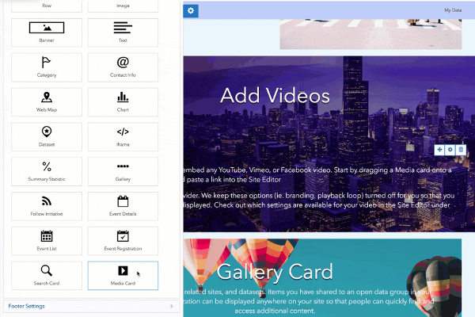

> **Note**: this page is only a draft, but this project is hosted on a [public repository](https://github.com/hhkaos/awesome-arcgis) where anyone can contribute. Learn how to [contribute in less than a minute](https://github.com/hhkaos/awesome-arcgis/blob/master/CONTRIBUTING.md#contributions).

# ArcGIS Hub

Provides a two-way engagement platform to connect government and citizens. Create websites for initiatives, display widgets linked to data published in ArcGIS Open Data (KPIs, tables, apps, etc.), publish events, etc.

  

<!-- START doctoc generated TOC please keep comment here to allow auto update -->
<!-- DON'T EDIT THIS SECTION, INSTEAD RE-RUN doctoc TO UPDATE -->
**Table of contents**

  - [Introduction](#introduction)
  - [Training](#training)
    - [Videos / Technical talks](#videos--technical-talks)
  - [Code](#code)
  - [Community](#community)
- [People you should know](#people-you-should-know)
  - [Get the tool](#get-the-tool)
  - [Spanish](#spanish)
  - [News](#news)
  - [Additional resources](#additional-resources)
    - [Related products or technologies](#related-products-or-technologies)
    - [Localized resources](#localized-resources)
      - [Spanish](#spanish-1)

<!-- END doctoc generated TOC please keep comment here to allow auto update -->

## Introduction

[ArcGIS Hub](http://www.esri.com/arcgis/products/arcgis-hub) provides a two-way engagement platform to connect government and citizens.

This product enable you to create new landing pages for initiatives, display widgets linked to data published in
[ArcGIS Open Data](../arcgis-online/arcgis-open-data) (KPIs, tables, apps, etc.), publish events, etc.

ArcGIS Hub is available at two license levels: Basic and Premium. ArcGIS Hub Basic is included with ArcGIS Online and delivers data sharing and site creation capabilities, while ArcGIS Hub Premium includes additional features and capabilities for working with teams of people (including members of the community).

ArcGIS Hub Sample Instance: [hub.arcgis.com](https://hub.arcgis.com/)

## Training

### Documentation

* [ArcGIS Hub official documentation](https://doc.arcgis.com/en/hub/).
* [ArcGIS Hub at esri.com/training](www.esri.com/training/Bookmark/PK5N54S86)

### Tutorials

* [Hub-Tutorials](https://github.com/esridc/Hub-Tutorials)
* [ArcGIS Hub How-To Youtube Playlist](https://www.youtube.com/playlist?list=PLGZUzt4E4O2Kw7tG6TiA_pflg-6-rO4rM)

### Videos / Technical talks

We have created an [ArcGIS Hub & Open Data](https://www.youtube.com/playlist?list=PLahIW2YFPQd4xhLDMSol9pyXP6EbdxkAV) that we think it might be worth to you to save ([how to save a Youtube Playlist](../../../assets/SavePlaylist.gif)).

On [*video.esri.com*](https://www.esri.com/videos/search?q=ArcGIS%20Hub#?sortby=recent) and [Esri Events](https://www.youtube.com/channel/UC_yE3TatdZKAXvt_TzGJ6mw/search?query=ArcGIS%20Hub) you will find many technical talks. Or check [Esri Geodev](https://www.youtube.com/channel/UCgCXcfk5uEraWkpE9wlRwgw) channel for short videos.

|Event|Title|Length|
|---|---|---|
|[DevSummit](http://www.esri.com/events/devsummit) 2020|[How ArcGIS Hub Delivers a Scalable Geospatial Platform on Kubernetes](https://www.youtube.com/watch?v=x3LaUyQJzME&list=PLahIW2YFPQd4xhLDMSol9pyXP6EbdxkAV&index=2&t=0s)|21min 36secs
|[DevSummit](http://www.esri.com/events/devsummit) 2020|[Effective Community Engagement with ArcGIS Hub](https://www.youtube.com/watch?v=hkQn6m-MtqU&list=PLahIW2YFPQd4xhLDMSol9pyXP6EbdxkAV&index=2)|57min 51secs
|[DevSummit](http://www.esri.com/events/devsummit) 2020|[Deep-Customization of Hub Sites and Enterprise Sites](https://www.youtube.com/watch?v=2OscukHpUeI&list=PLahIW2YFPQd4xhLDMSol9pyXP6EbdxkAV&index=3)|1h 10min 19secs
|[DevSummit](http://www.esri.com/events/devsummit) 2020|[Getting Started with Hub + Enterprise Sites](https://www.youtube.com/watch?v=WiAnWWET9gE&list=PLahIW2YFPQd4xhLDMSol9pyXP6EbdxkAV&index=4)|59min 01secs
|[User Conference](http://www.esri.com/events/uc) 2019|[ArcGIS Hub: An Introduction](https://www.youtube.com/watch?v=Y7-NDBcJd5w&list=PLahIW2YFPQd4xhLDMSol9pyXP6EbdxkAV&index=7)|55min 14secs
|[DevSummit](http://www.esri.com/events/devsummit) 2020|[Hub for Developers Demo](https://www.youtube.com/watch?v=TQpnNY7Uoc0&list=PLahIW2YFPQd4xhLDMSol9pyXP6EbdxkAV&index=12)|27min 53secs
|[GeoDev Webinar series](https://www.youtube.com/watch?v=8BObxY7ZtzA&list=PLGZUzt4E4O2ILC945g6dPRoRyyYTXoYmx) |ArcGIS Hub |n.a.
|[UC](http://www.esri.com/about/events/uc) 2017|[ArcGIS Online: Getting Started with Open Data and Initiatives in the ArcGIS Hub](https://www.youtube.com/watch?v=HsFdhsWQiI8)|1h 13min 43secs
|[UC](http://www.esri.com/about/events/uc) 2017|[Esri UC 2017: ArcGIS Hub](https://www.youtube.com/watch?v=7OrvBKEqQiU)|6m 37secs|

> You might also find interesting videos at [Esri Industries](https://www.youtube.com/channel/UCZTiOg3n0pqUDSatq7mS2PA/search?query="ArcGIS%20Hub"), [ArcGIS](https://www.youtube.com/channel/UCgGDPs8cte-VLJbgpaK4GPw/search?query="ArcGIS%20Hub"), [EsriTV](https://www.youtube.com/user/esritv/search?query="ArcGIS%20Hub"), [Esri R&D Center](https://www.youtube.com/user/esripdx/search?query="ArcGIS%20Hub") [etc](https://esri-es.github.io/awesome-arcgis/esri/#youtube-channels), and [distributor's Youtube Channels](../../../esri#youtube-channels)

### Slides

More slides in [*proceedings.esri.com*](https://www.google.es/search?q=site%3Aproceedings.esri.com+ArcGIS%20Hub) or check on [GeoNet](https://community.esri.com/content?query=ArcGIS%20Hub&filterID=all~objecttype~objecttype%5Bdocument%5D).

## Get the tool

ArcGIS Hub **Basic** is included with ArcGIS Online, you can use it from a free developer account, to any paid subscription.

In order tu buy a premium license [contact Esri](http://www.esri.com/about-esri/contact#international).

## Code

* [MyStreet](https://github.com/Esri/MyStreet): Prototype city-viewer app to demonstrate [hub-ready requirements](https://github.com/Esri/MyStreet/#hub-ready-checklist).

## Support and Community

If needed, remember you can always check the [Technical Support Website](https://support.esri.com/en/Search-Results#search?q=arcgis%20hub) and the [Technical Support Blog at GeoNet](https://community.esri.com/groups/technical-support/blog/tags#/) to find additional resources.

**Community channels:**

* [ArcGIS Hub on GeoNet](https://community.esri.com/community/gis/web-gis/arcgis-hub)

Vote/share the ideas about PRODUCT @ [ArcGIS Ideas on GeoNet](https://community.esri.com/community/arcgis-ideas/content?filterID=contentstatus%5Bpublished%5D~category%5Barcgis-hub%5D)

# People you should know

Please find the [ArcGIS Experts on this topic using this tool](https://esri-es.github.io/arcgis-experts/?topic=ArcGIS%20Hub):

They don't work on the support team and some may even not work at Esri,
but they are opening some projects and sharing insights related to this
technology so we recommend you to follow them.

You can also explore the experts in the [Awesome ArcGIS organization in ArcGIS Online](https://awesome-arcgis.maps.arcgis.com/home/group.html?id=f3807dde35134fb5b5f0cdc9b1b506f0&start=1&view=list#content).

## News

* [ArcGIS Hub category at blogs.esri.com](https://blogs.esri.com/esri/arcgis/category/arcgis-hub/)
    * [How to create templates of your ArcGIS Hub initiatives](https://www.esri.com/arcgis-blog/products/arcgis-hub/constituent-engagement/how-to-create-templates-of-your-arcgis-hub-content/)
    * [Translating ArcGIS Hub sites and pages](https://www.esri.com/arcgis-blog/products/arcgis-hub/constituent-engagement/translating-hub-sites-and-pages/)
    * [Create a gallery of content using ArcGIS Hub](https://www.esri.com/arcgis-blog/products/arcgis-hub/design-planning/make-your-content-shine-with-arcgis-hub/)
    * [A quick start guide to ArcGIS Hub Basic](https://www.esri.com/arcgis-blog/products/arcgis-hub/constituent-engagement/launch-a-website-in-five-steps/)
* [ArcGIS Hub Blog on GeoNet](https://community.esri.com/community/gis/web-gis/arcgis-hub)

## Additional resources

Probably not all the resources are in this list, please use the [ArcGIS Search](https://esri-es.github.io/arcgis-search/) tool looking for: ["arcgis hub"](https://esri-es.github.io/arcgis-search/?amp%3Butm_source=opensearch&search=%22arcgis+hub%22&utm_campaign=awesome-list&utm_source=awesome-list&utm_medium=page).

### Related products or technologies

List of all Esri products in the ["Esri Products - ArcGIS Platform" group](https://awesome-arcgis.maps.arcgis.com/home/group.html?id=663480a878724c42aef09a523a8d5139&view=list&start=1&num=20#content)

### Localized resources

#### Spanish

* [Página de producto de ArcGIS Hub](https://www.esri.es/producto/arcgis-hub/)
 * [ArcGIS Hub en la Conferencia Esri España 2018](https://youtu.be/3kZfWIQHFgQ?t=14m44s)
* [Construyendo “Smart Communities” con ArcGIS Hub](https://www.youtube.com/watch?v=bBIkPkhU3zk)

## Contributions

Feel free to improve/extend this resource page using [this template](https://github.com/hhkaos/awesome-arcgis/blob/master/templates/ArcGIS%20Hub_PAGE_TEMPLATE.md) ([Contribution Guide](https://github.com/hhkaos/awesome-arcgis/blob/master/CONTRIBUTING.md)).
