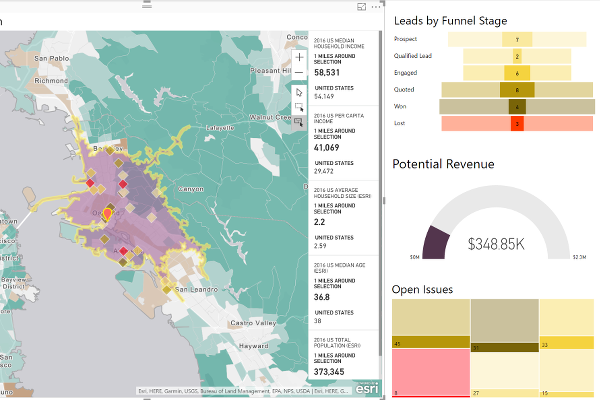

> **Note**: this page is only a draft, but this project is hosted on a [public repository](https://github.com/hhkaos/awesome-arcgis) where anyone can contribute. Learn how to [contribute in less than a minute](https://github.com/hhkaos/awesome-arcgis/blob/master/CONTRIBUTING.md#contributions).

# ArcGIS Maps for Power BI

Microsoft Power BI users can tap into the power of geospatial analytics, and access new map themes, demographic data, and map visualizations, inside Power BI.

<!-- START doctoc generated TOC please keep comment here to allow auto update -->
<!-- DON'T EDIT THIS SECTION, INSTEAD RE-RUN doctoc TO UPDATE -->
**Table of contents**

- [Introduction](#introduction)
- [Additional resources](#additional-resources)
  - [Related products or technologies](#related-products)
- [Contributions](#contributions)

<!-- END doctoc generated TOC please keep comment here to allow auto update -->

## Introduction

Check the [ArcGIS Maps for Power BI product page](http://www.esri.com/software/arcgis/arcgis-maps-for-power-bi).

And this **Service delivery analysis** video using ArcGIS Maps for Power BI:

## Additional resources

Probably not all the resources are in this list, please use the [ArcGIS Search](https://esri-es.github.io/arcgis-search/) tool looking for: ["ArcGIS Maps for Power BI"](https://esri-es.github.io/arcgis-search/?search="ArcGIS Maps for Power BI"&utm_campaign=awesome-list&utm_source=awesome-list&utm_medium=page).

### Related products or technologies

List of all Esri products in the ["Esri Products - ArcGIS Platform" group](https://awesome-arcgis.maps.arcgis.com/home/group.html?id=663480a878724c42aef09a523a8d5139&view=list&start=1&num=20#content)

## Contributions

Feel free to improve/extend this resource page using [this template](https://github.com/hhkaos/awesome-arcgis/blob/master/templates/PRODUCT_PAGE_TEMPLATE.md) ([Contribution Guide](https://github.com/hhkaos/awesome-arcgis/blob/master/CONTRIBUTING.md)).
