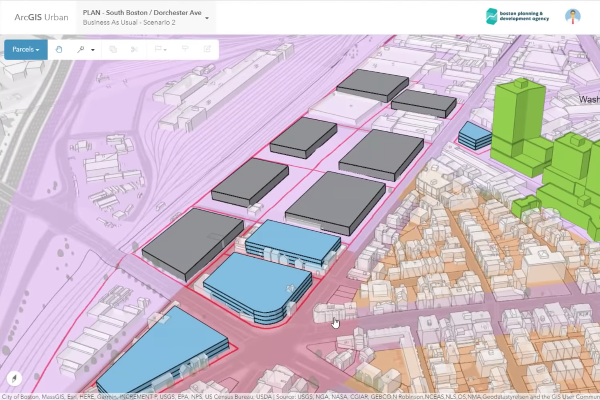

> **Note**: this page is only a draft, but this project is hosted on a [public repository](https://github.com/hhkaos/awesome-arcgis) where anyone can contribute. Learn how to [contribute in less than a minute](https://github.com/hhkaos/awesome-arcgis/blob/master/CONTRIBUTING.md#contributions).

# ArcGIS Urban

Collection of web-based and desktop tools  to help you design, manage and measure the impact of your urban plans. It also provides a new way ofCollaborate across departments and agencies to make the right decisions for the community.

  

<!-- START doctoc generated TOC please keep comment here to allow auto update -->
<!-- DON'T EDIT THIS SECTION, INSTEAD RE-RUN doctoc TO UPDATE -->
**Table of contents**

- [Introduction](#introduction)
- [Training](#training)
- [Videos](#videos)
- [Additional resources](#additional-resources)
  - [Related products or technologies](#related-products)
- [Contributions](#contributions)

<!-- END doctoc generated TOC please keep comment here to allow auto update -->

## Introduction

Learn more at: [esri.com/en-us/landing-page/product/2018/arcgis-urban](https://www.esri.com/en-us/landing-page/product/2018/arcgis-urban)

## Training

## Videos

* [Boston Planning & Development Agency: A New Revolution in Urban Planning](https://www.youtube.com/watch?v=Ha025XKSPdU)

## Additional resources

Probably not all the resources are in this list, please use the [ArcGIS Search](https://esri-es.github.io/arcgis-search/) tool looking for: ["ArcGIS Urban"](https://esri-es.github.io/arcgis-search/?search="ArcGIS Urban"&utm_campaign=awesome-list&utm_source=awesome-list&utm_medium=page).

### Related products or technologies

List of all Esri products in the ["Esri Products - ArcGIS Platform" group](https://awesome-arcgis.maps.arcgis.com/home/group.html?id=663480a878724c42aef09a523a8d5139&view=list&start=1&num=20#content)

## Contributions

Feel free to improve/extend this resource page using [this template](https://github.com/hhkaos/awesome-arcgis/blob/master/templates/PRODUCT_PAGE_TEMPLATE.md) ([Contribution Guide](https://github.com/hhkaos/awesome-arcgis/blob/master/CONTRIBUTING.md)).
