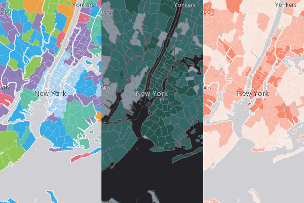

> **Note**: this page is only a draft, but this project is hosted on a [public repository](https://github.com/hhkaos/awesome-arcgis) where anyone can contribute. Learn how to [contribute in less than a minute](https://github.com/hhkaos/awesome-arcgis/blob/master/CONTRIBUTING.md#contributions).

# Esri Demographics

It is a global collection of demographic, psychographic, and socioeconomic data, with over 15,000 data variables from 130+ countries. Updated regularly you can integrate datasets into your workflows by consuming them as maps, charts, infographics, reports, and more.

<!-- START doctoc generated TOC please keep comment here to allow auto update -->
<!-- DON'T EDIT THIS SECTION, INSTEAD RE-RUN doctoc TO UPDATE -->
**Table of contents**

- [Introduction](#introduction)
- [Training](#training)
  - [Documentation](#documentation)
- [Additional resources](#additional-resources)
  - [Related products or technologies](#related-products)
- [Contributions](#contributions)

<!-- END doctoc generated TOC please keep comment here to allow auto update -->

## Introduction

[Esri Demographics](https://www.esri.com/en-us/arcgis/products/esri-demographics/overview) are available across the ArcGIS platform, offering a comprehensive set of global demographic and spending data for mapping and analysis purposes. Esri Demographics are available in the following products:

* [Living Atlas](../../living-atlas/README.md)
* [ArcGIS Business analyst](../arcgis-business-analyst/README.md)
* [ArcGIS Community analyst](../arcgis-community-analyst/README.md)
* [ArcGIS for Developers](../../developers/README.md) (every API and SDK)
* [ArcGIS Maps for Office](../arcgis-maps-for-office/README.md)
* [ArcGIS Maps for PowerBI](../arcgis-maps-for-power-bi/README.md)
* [ArcGIS Maps for Sharepoint](../arcgis-maps-for-sharepoint/README.md)
* [ArcGIS Online](../arcgis-online/README.md)
* [ArcGIS Pro](../arcgis-desktop/arcgis-pro/README.md)
* [Esri Reports](https://www.esri.com/en-us/arcgis/products/buy-reports/overview)
* [Insights for ArcGIS](../insights-for-arcgis/README.md)
* [GeoPlanner for ArcGIS](../geoplanner-for-arcgis/README.md)

## Training

### Documentation

[Esri Demographics Official Documentation](http://doc.arcgis.com/en/esri-demographics/)

## Additional resources

Probably not all the resources are in this list, please use the [ArcGIS Search](https://esri-es.github.io/arcgis-search/) tool looking for: ["Esri Demographics"](https://esri-es.github.io/arcgis-search/?search="Esri Demographics"&utm_campaign=awesome-list&utm_source=awesome-list&utm_medium=page).

### Related products or technologies

List of all Esri products in the ["Esri Products - ArcGIS Platform" group](https://awesome-arcgis.maps.arcgis.com/home/group.html?id=663480a878724c42aef09a523a8d5139&view=list&start=1&num=20#content)

## Contributions

Feel free to improve/extend this resource page using [this template](https://github.com/hhkaos/awesome-arcgis/blob/master/templates/PRODUCT_PAGE_TEMPLATE.md) ([Contribution Guide](https://github.com/hhkaos/awesome-arcgis/blob/master/CONTRIBUTING.md)).
