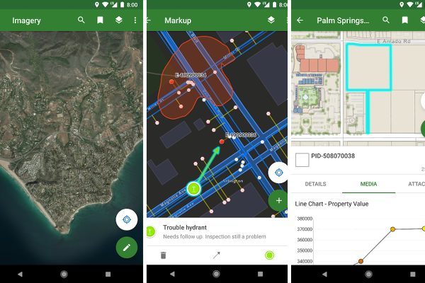

> **Note**: this page is only a draft, but this project is hosted on a [public repository](https://github.com/hhkaos/awesome-arcgis) where anyone can contribute. Learn how to [contribute in less than a minute](https://github.com/hhkaos/awesome-arcgis/blob/master/CONTRIBUTING.md#contributions).

# Explorer for ArcGIS

Access your maps from your mobile device 24/7. Wherever you go, take searchable maps that include markup and measurement tools to easily find your way and to communicate with others about landmarks, assets, and areas of interest.

 

<!-- START doctoc generated TOC please keep comment here to allow auto update -->
<!-- DON'T EDIT THIS SECTION, INSTEAD RE-RUN doctoc TO UPDATE -->
**Table of contents**

- [Introduction](#introduction)
- [People you should know](#people-you-should-know)
- [Additional resources](#additional-resources)
  - [Related products or technologies](#related-products-or-technologies)
- [Contributions](#contributions)

<!-- END doctoc generated TOC please keep comment here to allow auto update -->

## Introduction

## People you should know

Please find the ArcGIS Experts (story tellers and developers) on this topic here: [https://esri-es.github.io/arcgis-experts/?topic=Explorer%20for%20ArcGIS](https://esri-es.github.io/arcgis-experts/?topic=Explorer%20for%20ArcGIS)

They don't work on the support team and some may even not work at Esri,
but they are opening some projects and sharing insights related to this
technology so we recommend you to follow them.

## Additional resources

Probably not all the resources are in this list, please use the [ArcGIS Search](https://esri-es.github.io/arcgis-search/) tool looking for: ["Explorer for ArcGIS"](https://esri-es.github.io/arcgis-search/?search="Explorer for ArcGIS"&utm_campaign=awesome-list&utm_source=awesome-list&utm_medium=page).

### Related products or technologies

List of all Esri products in the ["Esri Products - ArcGIS Platform" group](https://awesome-arcgis.maps.arcgis.com/home/group.html?id=663480a878724c42aef09a523a8d5139&view=list&start=1&num=20#content)

## Contributions

Feel free to improve/extend this resource page using [this template](https://github.com/hhkaos/awesome-arcgis/blob/master/templates/PRODUCT_PAGE_TEMPLATE.md) ([Contribution Guide](https://github.com/hhkaos/awesome-arcgis/blob/master/CONTRIBUTING.md)).
