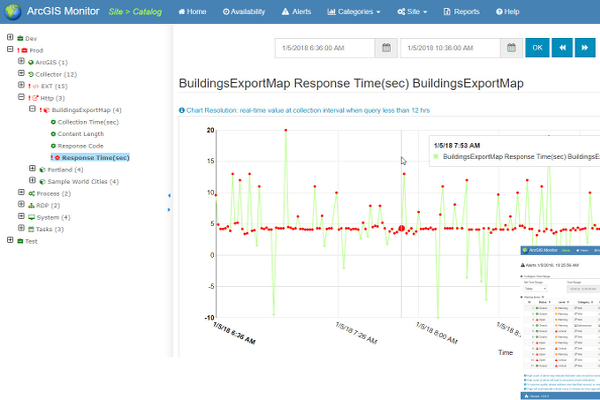

> **Note**: this page is only a draft, but this project is hosted on a [public repository](https://github.com/hhkaos/awesome-arcgis) where anyone can contribute. Learn how to [contribute in less than a minute](https://github.com/hhkaos/awesome-arcgis/blob/master/CONTRIBUTING.md#contributions).

# ArcGIS Monitor - Extension

Monitor the health of your ArcGIS implementations throughout the lifecycle. It provides awareness of system usage and performance, helping you get the most from your GIS and IT investment.    

  

<!-- START doctoc generated TOC please keep comment here to allow auto update -->
<!-- DON'T EDIT THIS SECTION, INSTEAD RE-RUN doctoc TO UPDATE -->
**Table of contents**

- [Introduction](#introduction)
- [Additional resources](#additional-resources)
- [Contributions](#contributions)

<!-- END doctoc generated TOC please keep comment here to allow auto update -->

## Introduction

Learn more at: [esri.com/en-us/arcgis/products/arcgis-monitor/overview](https://www.esri.com/en-us/arcgis/products/arcgis-monitor/overview)

## Additional resources

Probably not all the resources are in this list, please use the [ArcGIS Search](https://esri-es.github.io/arcgis-search/) tool looking for: ["ArcGIS Monitor"](https://esri-es.github.io/arcgis-search/?search="ArcGIS Monitor"&utm_campaign=awesome-list&utm_source=awesome-list&utm_medium=page).

## Contributions

Feel free to improve/extend this resource page using [this template](https://github.com/hhkaos/awesome-arcgis/blob/master/templates/PRODUCT_PAGE_TEMPLATE.md) ([Contribution Guide](https://github.com/hhkaos/awesome-arcgis/blob/master/CONTRIBUTING.md)).
