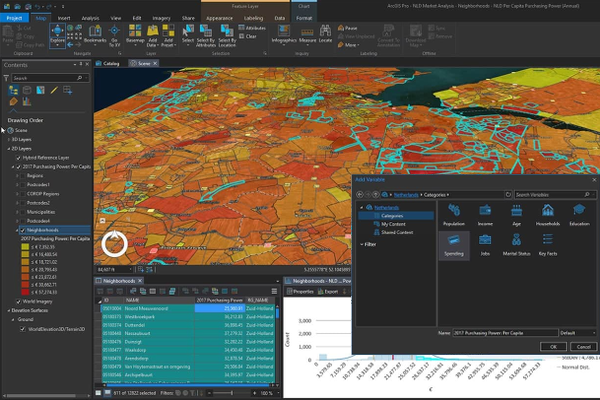

> **Note**: this page is only a draft, but this project is hosted on a [public repository](https://github.com/hhkaos/awesome-arcgis) where anyone can contribute. Learn how to [contribute in less than a minute](https://github.com/hhkaos/awesome-arcgis/blob/master/CONTRIBUTING.md#contributions).

# ArcGIS Business Analyst - Extensions

 Combine demographic, lifestyle, and spending data with map-based analytics for accurate reports and dynamic presentations, share spatial analytics and models, publish demographic and consumer insight dashboards, ...

  

<!-- START doctoc generated TOC please keep comment here to allow auto update -->
<!-- DON'T EDIT THIS SECTION, INSTEAD RE-RUN doctoc TO UPDATE -->
**Table of contents**

- [Introduction](#introduction)
  - [Related products or technologies](#related-products)
- [Additional resources](#additional-resources)
- [Contributions](#contributions)

<!-- END doctoc generated TOC please keep comment here to allow auto update -->

## Introduction

There are extensions for ArcMap, ArcGIS Pro and ArcGIS Enterprise:

* [Business Analyst Desktop](https://www.esri.com/en-us/arcgis/products/arcgis-business-analyst/applications/desktop): See people and opportunities clearly through ArcGIS Pro or ArcMap. Business Analyst provides location-based intelligence for planning, site selection, and customer segmentation. Combine demographic, lifestyle, and spending data with map-based analytics for accurate reports and dynamic presentations

* [Business Analyst Server](http://server.arcgis.com/en/server/latest/get-started/windows/what-is-arcgis-business-analyst-server-.htm): Share spatial analytics and models using ArcGIS Business Analyst Enterprise. Publish demographic and consumer insight dashboards. Implement out-of-the-box web applications to collaborate internally across your enterprise and externally with clients.

> Check the [ArcGIS Enterprise Functionality Matrix](https://assets.esri.com/content/dam/esrisites/media/brochures/arcgis-enterprise-functionality-matrix.pdf)

### Related products or technologies

* [ArcGIS Business Analyst Web and Mobile Apps](../business-analyst/README.md)

## Additional resources

Probably not all the resources are in this list, please use the [ArcGIS Search](https://esri-es.github.io/arcgis-search/) tool looking for: ["Business Analyst"](https://esri-es.github.io/arcgis-search/?search="Business Analyst"&utm_campaign=awesome-list&utm_source=awesome-list&utm_medium=page).

## Contributions

Feel free to improve/extend this resource page using [this template](https://github.com/hhkaos/awesome-arcgis/blob/master/templates/PRODUCT_PAGE_TEMPLATE.md) ([Contribution Guide](https://github.com/hhkaos/awesome-arcgis/blob/master/CONTRIBUTING.md)).
