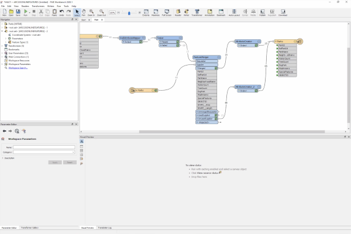

> **Note**: this page is only a draft, but this project is hosted on a [public repository](https://github.com/hhkaos/awesome-arcgis) where anyone can contribute. Learn how to [contribute in less than a minute](https://github.com/hhkaos/awesome-arcgis/blob/master/CONTRIBUTING.md#contributions).

# Data Interoperability - Extension

Extension for ArcGIS Pro, ArcMap, and ArcGIS Enterprise that bring spatial data from many sources into the ArcGIS environment for mapping, visualization, and analysis. Access not just geodatabases but hundreds (+400) of different files, databases, services, feeds, and more.

  

<!-- START doctoc generated TOC please keep comment here to allow auto update -->
<!-- DON'T EDIT THIS SECTION, INSTEAD RE-RUN doctoc TO UPDATE -->
**Table of contents**

- [Introduction](#introduction)
- [Additional resources](#additional-resources)
  - [Related products or technologies](#related-products-or-technologies)
- [Contributions](#contributions)

<!-- END doctoc generated TOC please keep comment here to allow auto update -->

## Introduction

Learn more about [ArcGIS Data Interoperability Extension](https://www.esri.com/en-us/arcgis/products/arcgis-data-interoperability/overview)

## Training

### Documentation

* All versions:
    * [FME Readers and Writers](https://pro.arcgis.com/en/pro-app/help/data/data-interoperability/pdf/FMEReadersWriters.pdf)
    * [ArcGIS Data Interoperability Supported Formats](https://www.esri.com/library/fliers/pdfs/data-interop-formats.pdf)
    * [Data Interoperability Best Practices and Common Uses](https://proceedings.esri.com/library/userconf/proc18/tech-workshops/tw_1802-19.pdf)
    * [Featured Web Connections Available - ArcGIS Data Interoperability](https://www.esri.com/content/dam/esrisites/en-us/media/pdf/arcgis-data-interoperability-featured-web-connections.pdf)
    * [Data Interoperability Esri Staff Posts](https://community.esri.com/community/open-platform-standards-and-interoperability/content?filterID=contentstatus%5Bpublished%5D~category%5Bdata-interoperability-etl%5D&filterID=contentstatus%5Bpublished%5D~objecttype~objecttype%5Bblogpost%5D)
* Desktop (ArcGIS Pro / ArcMap):
    * [ArcGIS Data Interoperability extension for Desktop](https://pro.arcgis.com/en/pro-app/help/data/data-interoperability/what-is-the-data-interoperability-extension.htm)
    * [Data Interoperability - ArcMap](https://desktop.arcgis.com/en/arcmap/latest/extensions/data-interoperability/what-is-the-data-interoperability-extension-.htm)
* Enterprise (Server)
    * [ArcGIS Data Interoperability - GIS Server Extension](https://enterprise.arcgis.com/en/server/latest/get-started/windows/server-extensions.htm#ESRI_SECTION1_AB7968F151BD401C8FDFDE69C041F4D8)
    * [ArcMap - Publishing Data Interoperability tools with ArcGIS Server](https://desktop.arcgis.com/en/arcmap/latest/extensions/data-interoperability/publishing-data-interoperability-tools-with-arcgis-server.htm)
* Esri Training: [seminars & web courses](https://community.safe.com/s/documentation/)

> You can also check the [official documentation for FME Desktop, FME Server, and FME Cloud](https://community.safe.com/s/documentation/)

### Tutorials

* [FME Desktop Basic Training Manual](https://s3.amazonaws.com/gitbook/Desktop-Basic-2019/index.html)
* [Workspace Authoring for FME Server Training Manual](https://s3.amazonaws.com/gitbook/Server-Authoring-2019/index.html)
* [FME Training on Github](https://github.com/safesoftware/FMETraining)
* [ArcMap Data Interoperability Extension Tutorial](http://help.arcgis.com/es/arcgisdesktop/10.8/pdf/tutorial_data_interoperability_extension.pdf)

### Videos

|Event|Title|Length|
|---|---|---|
|n.a.|[ArcGIS Data Interoperability in ArcGIS Pro](https://www.youtube.com/watch?v=ijWacWFXB0w)| 48min 16secs|

> You might also find interesting videos at [FME YT channel](https://www.youtube.com/c/FMEchannel/playlists), [Esri Industries](https://www.youtube.com/channel/UCZTiOg3n0pqUDSatq7mS2PA/search?query="PRODUCT"), [ArcGIS](https://www.youtube.com/channel/UCgGDPs8cte-VLJbgpaK4GPw/search?query="PRODUCT"), [EsriTV](https://www.youtube.com/user/esritv/search?query="PRODUCT"), [Esri R&D Center](https://www.youtube.com/user/esripdx/search?query="PRODUCT") [etc](https://esri-es.github.io/awesome-arcgis/esri/#youtube-channels), and [distributor's Youtube Channels](../../../esri#youtube-channels)

## Community

* ["ArcGIS Data Interoperability" on GeoNet](https://community.esri.com/search.jspa?q=ArcGIS%20Data%20Interoperability)
* [Open Platform: Standards and Interoperability
ActionsAbout Open Platform: Standards and Interoperability](https://community.esri.com/community/open-platform-standards-and-interoperability/content?filterID=contentstatus%5Bpublished%5D~category%5Bdata-interoperability-etl%5D)

## News

More news:

* [Leveraging Data for External Systems - Automating Export Subnetwork using Data Interoperability](https://www.esri.com/arcgis-blog/products/utility-network/data-management/exporting-subnetworks-using-data-interoperability/) - [Part 2](https://www.esri.com/arcgis-blog/products/utility-network/data-management/exporting-subnetworks-using-data-interoperability-part2/)
* [Blog Posts about "Data Interoperability" inside Places at GeoNet](https://community.esri.com/community/open-platform-standards-and-interoperability/content?filterID=contentstatus%5Bpublished%5D~category%5Bdata-interoperability-etl%5D&filterID=contentstatus%5Bpublished%5D~objecttype~objecttype%5Bblogpost%5D)
* etc

## Additional resources

Probably not all the resources are in this list, please use the [ArcGIS Search](https://esri-es.github.io/arcgis-search/) tool looking for: ["Data Interoperability"](https://esri-es.github.io/arcgis-search/?search="Data%20Interoperability"&utm_campaign=awesome-list&utm_source=awesome-list&utm_medium=page).

### Related products or technologies

* [Koop - an open source GeoSpatial ETL engine](https://koopjs.github.io/)
* List of all Esri products in the ["Esri Products - ArcGIS Platform" group](https://awesome-arcgis.maps.arcgis.com/home/group.html?id=663480a878724c42aef09a523a8d5139&view=list&start=1&num=20#content)
* Sample site using FME Server: (similar use case to Data interoperability on Enterprise)
    * [geokatalog.buergernetz.bz.it](http://geokatalog.buergernetz.bz.it/geokatalog/#!)
    * [geoportalcartografia.amb.cat](https://geoportalcartografia.amb.cat/AppGeoportalCartografia2/index.html?locale=es)
* [Ejemplo de Importación de archivos GML](https://www.youtube.com/watch?v=6cj2cCxC6Rg) (video: 1min 52secs)
* [Webinar Open Platform ArcGIS](https://www.youtube.com/watch?v=R-cZiwd0_9Y)

## Contributions

Feel free to improve/extend this resource page using [this template](https://github.com/hhkaos/awesome-arcgis/blob/master/templates/PRODUCT_PAGE_TEMPLATE.md) ([Contribution Guide](https://github.com/hhkaos/awesome-arcgis/blob/master/CONTRIBUTING.md)).
