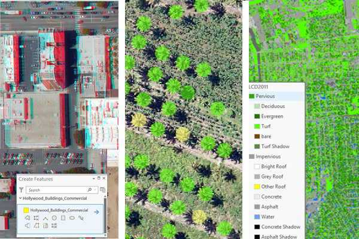

> **Note**: this page is only a draft, but this project is hosted on a [public repository](https://github.com/hhkaos/awesome-arcgis) where anyone can contribute. Learn how to [contribute in less than a minute](https://github.com/hhkaos/awesome-arcgis/blob/master/CONTRIBUTING.md#contributions).

# Image Analyst - Extension

This ArcGIS Pro extension gives you access to enriched visualization, geospatial analytics, and powerful image exploitation tools. It is designed for analysts, scientists, and photogrammetrists who focus on image processing, interpretation, analysis, and the creation of information products from remotely sensed data.

  

<!-- START doctoc generated TOC please keep comment here to allow auto update -->
<!-- DON'T EDIT THIS SECTION, INSTEAD RE-RUN doctoc TO UPDATE -->
**Table of contents**

- [Introduction](#introduction)
  - [Additional resources](#additional-resources)
    - [Related products](#related-products)
  - [Contributions](#contributions)

<!-- END doctoc generated TOC please keep comment here to allow auto update -->

# Introduction

[Learn more](https://www.esri.com/en-us/arcgis/products/arcgis-image-analyst/overview)

## Additional resources

Probably not all the resources are in this list, please use the [ArcGIS Search](https://esri-es.github.io/arcgis-search/) tool looking for: ["Image Analyst"](https://esri-es.github.io/arcgis-search/?search="Image Analyst"&utm_campaign=awesome-list&utm_source=awesome-list&utm_medium=page).

### Related products

List of all Esri products in the ["Esri Products - ArcGIS Platform" group](https://awesome-arcgis.maps.arcgis.com/home/group.html?id=663480a878724c42aef09a523a8d5139&view=list&start=1&num=20#content)

## Contributions

Feel free to improve/extend this resource page using [this template](https://github.com/hhkaos/awesome-arcgis/blob/master/templates/PRODUCT_PAGE_TEMPLATE.md) ([Contribution Guide](https://github.com/hhkaos/awesome-arcgis/blob/master/CONTRIBUTING.md)).
