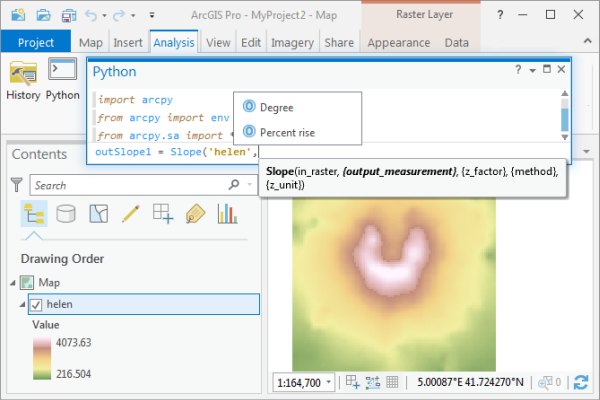

> **Note**: this page is only a draft, but this project is hosted on a [public repository](https://github.com/hhkaos/awesome-arcgis) where anyone can contribute. Learn how to [contribute in less than a minute](https://github.com/hhkaos/awesome-arcgis/blob/master/CONTRIBUTING.md#contributions).

# Spatial Analyst - Extension

This extension for ArcGIS Pro, ArcMap and ArcGIS Enterprise provide advanced spatial modeling and analysis tools. It helps with modeling terrains, finding suitable locations and routes, discovering spatial patterns, and performing hydrologic and statistical analysis.

  

<!-- START doctoc generated TOC please keep comment here to allow auto update -->
<!-- DON'T EDIT THIS SECTION, INSTEAD RE-RUN doctoc TO UPDATE -->
**Table of contents**

- [Introduction](#introduction)
  - [Additional resources](#additional-resources)
    - [Related products](#related-products)
  - [Contributions](#contributions)

<!-- END doctoc generated TOC please keep comment here to allow auto update -->

# Introduction

[Learn more](http://www.esri.com/software/arcgis/extensions/spatialanalyst)

## Additional resources

Probably not all the resources are in this list, please use the [ArcGIS Search](https://esri-es.github.io/arcgis-search/) tool looking for: ["Spatial Analyst"](https://esri-es.github.io/arcgis-search/?search="Spatial Analyst"&utm_campaign=awesome-list&utm_source=awesome-list&utm_medium=page).

### Related products

List of all Esri products in the ["Esri Products - ArcGIS Platform" group](https://awesome-arcgis.maps.arcgis.com/home/group.html?id=663480a878724c42aef09a523a8d5139&view=list&start=1&num=20#content)

## Contributions

Feel free to improve/extend this resource page using [this template](https://github.com/hhkaos/awesome-arcgis/blob/master/templates/PRODUCT_PAGE_TEMPLATE.md) ([Contribution Guide](https://github.com/hhkaos/awesome-arcgis/blob/master/CONTRIBUTING.md)).
