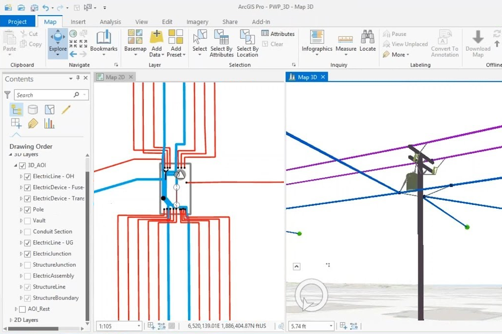

> **Note**: this page is only a draft, but this project is hosted on a [public repository](https://github.com/hhkaos/awesome-arcgis) where anyone can contribute. Learn how to [contribute in less than a minute](https://github.com/hhkaos/awesome-arcgis/blob/master/CONTRIBUTING.md#contributions).

# Utility Network - Extension

The ArcGIS Utility Network Management extension **for ArcGIS Enterprise** is designed for utilities and telecoms. It provides location-based data and asset management, plus network modeling, editing, and analysis. You will be able to model your entire utility network in ArcGIS at a level of detail that was never before possible.

<!-- START doctoc generated TOC please keep comment here to allow auto update -->
<!-- DON'T EDIT THIS SECTION, INSTEAD RE-RUN doctoc TO UPDATE -->
**Table of contents**

- [Introduction](#introduction)
- [Additional resources](#additional-resources)
  - [Localized resources](#localized-resources)
    - [Spain](#spain)

<!-- END doctoc generated TOC please keep comment here to allow auto update -->

## Introduction

[Learn more](http://www.esri.es/producto/utility-network/) and on this whitepaper: [How the ArcGIS Utility Network Management Extension Supports Electric Utilities](http://ficheros.esri.es/2019/descargables/White%20paper%20Utility%20Network%20Ingl%C3%A9s.pdf)

 https://www.youtube.com/watch?v=zcM2N9Hjez0 

Storymaps:

* [Inside the electric network](https://gdbteam.maps.arcgis.com/apps/Cascade/index.html?appid=03789cced5e04b5f8a11ae7357cac915): Complete asset management, advanced network analysis, and deep system modeling
* [Modeling the electric system](https://gdbteam.maps.arcgis.com/apps/Cascade/index.html?appid=e8a78203d79042acbec87255d45e6ab9): Achieving high-performance, accurate representation, and advanced analysis with the electric network
* [Building the electric network](https://gdbteam.maps.arcgis.com/apps/Cascade/index.html?appid=42a3d0e8de544fdf98a26494b1fc5caa): Patterns for modeling the electric utility

## News

* ["Utility Network" at esri.com search engine](https://www.esri.com/arcgis-blog/?s=#&tag=utility-network)
* [Blog Posts about "Utility Network" inside Places at GeoNet](https://community.esri.com/content?query=Utility Network&filterID=all~objecttype~objecttype%5Bblogpost%5D)

## Additional resources

* [Esri Case Study: CoServ](https://www.esri.com/videos/watch?videoid=iVZS6w1imZQ&channelid=UCZTiOg3n0pqUDSatq7mS2PA&title=Esri%20Case%20Study:%20CoServ)

Probably not all the resources are in this list, please use the [ArcGIS Search](https://esri-es.github.io/arcgis-search/) tool looking for: ["utility network"](https://esri-es.github.io/arcgis-search/?search="utility network"&utm_campaign=awesome-list&utm_source=awesome-list&utm_medium=page).

### Localized resources

#### Spain

* [Utility Management Network](http://recursosutilitynetwork.esri.es/)
    * [¿Qué es una red de servicios?](http://ficheros.esri.es/2019/descargables/Empezando%20a%20trabajar%20Utility%20Network%20.pdf)
    * [¿Cómo la extensión ArcGIS Utility Network Management ayuda a las empresas de electricidad?](http://ficheros.esri.es/2019/descargables/White%20Paper%20Utility%20Network.pdf)
* [Página de producto Utility Network](http://www.esri.es/producto/utility-network/): [webinar disponible](https://www.esri.es/producto/utility-network/#layout-6)
