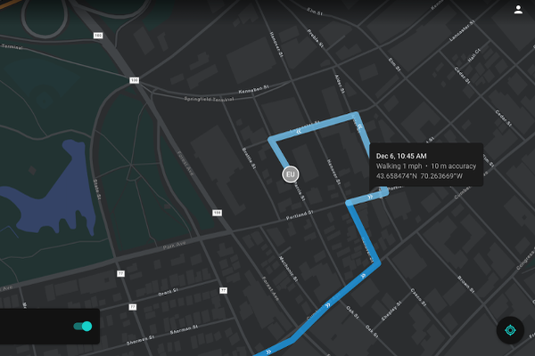

> **Note**: this page is only a draft, but this project is hosted on a [public repository](https://github.com/hhkaos/awesome-arcgis) where anyone can contribute. Learn how to [contribute in less than a minute](https://github.com/hhkaos/awesome-arcgis/blob/master/CONTRIBUTING.md#contributions).

# Tracker for ArcGIS

Know the real-time location of your most valued assets, your mobile users. Using Tracker to effortlessly capture location track data and feed it back into ArcGIS, you achieve control and agility to effectively allocate personnel to field needs, even in rapidly changing circumstances.

  

<!-- START doctoc generated TOC please keep comment here to allow auto update -->
<!-- DON'T EDIT THIS SECTION, INSTEAD RE-RUN doctoc TO UPDATE -->
**Table of contents**

- [Introduction](#introduction)
  - [Videos](#videos)
  - [News](#news)
  - [Additional resources](#additional-resources)
    - [Related products or technologies](#related-products-or-technologies)
  - [Contributions](#contributions)

<!-- END doctoc generated TOC please keep comment here to allow auto update -->

# Introduction

[Learn more](http://enterprise.arcgis.com/en/portal/latest/administer/windows/what-s-new-in-portal-for-arcgis.htm#ESRI_SECTION2_927B59C427CC4853A7729FA0EEF9F033)

## Videos

[Location Tracking for Field Operations](https://www.youtube.com/watch?v=5sh1OVfUPi8)

## News

* [Location Tracking Debuted at Esri User Conference (July 2018)](https://www.esri.com/arcgis-blog/products/apps/field-mobility/location-tracking-debut-at-esri-international-users-conference-july-9th/)

## Additional resources

Probably not all the resources are in this list, please use the [ArcGIS Search](https://esri-es.github.io/arcgis-search/) tool looking for: ["Tracker for ArcGIS"](https://esri-es.github.io/arcgis-search/?search="Tracker for ArcGIS"&utm_campaign=awesome-list&utm_source=awesome-list&utm_medium=page).

### Related products or technologies

List of all Esri products in the ["Esri Products - ArcGIS Platform" group](https://awesome-arcgis.maps.arcgis.com/home/group.html?id=663480a878724c42aef09a523a8d5139&view=list&start=1&num=20#content)

## Contributions

Feel free to improve/extend this resource page using [this template](https://github.com/hhkaos/awesome-arcgis/blob/master/templates/PRODUCT_PAGE_TEMPLATE.md) ([Contribution Guide](https://github.com/hhkaos/awesome-arcgis/blob/master/CONTRIBUTING.md)).
