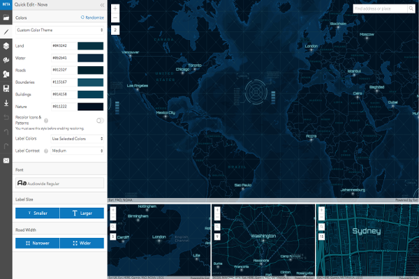

# Vector Tile Style Editor

Explore any part of the world with ArcGIS Earth. Work with a variety of 3D and 2D map data formats … including KML.

  

<!-- START doctoc generated TOC please keep comment here to allow auto update -->
<!-- DON'T EDIT THIS SECTION, INSTEAD RE-RUN doctoc TO UPDATE -->
**Table of contents**

- [Introduction](#introduction)
- [Training](#training)
  - [Tutorials](#tutorials)
  - [Videos](#videos)
- [Support and Community](#support-and-community)
- [News](#news)
- [Additional resources](#additional-resources)
  - [Related products or technologies](#related-products-or-technologies)
- [Contributions](#contributions)

<!-- END doctoc generated TOC please keep comment here to allow auto update -->

## Introduction

> **Disclaimer**: Although this application could be considered a product as such, you will not find any landing page on Esri.com promoting it.

You can access it on through: [developers.arcgis.com/vector-tile-style-editor/](https://developers.arcgis.com/vector-tile-style-editor/)

## Training

### Tutorials

* [Style a vector basemap](https://developers.arcgis.com/labs/arcgisonline/style-a-vector-basemap/) - 10min

### Videos

* [Vector Basemaps styling demo](https://www.youtube.com/watch?v=Ks4P2Z7Xu3s) ~3min
* [Styling Vector Tiles](https://www.youtube.com/watch?v=O54D0kilFtc) ~7min
* [Customizing and Styling Vector Basemaps](https://www.youtube.com/watch?v=COf8isFlebE) ~1h

## Support and Community

If needed, remember you can always check the [Technical Support Website for developer products](https://support.esri.com/en/Products/Developers) and the [Technical Support Blog at GeoNet](https://community.esri.com/groups/technical-support/blog/tags#/) to find additional resources.

**Community channels:**

* [ArcGIS Vector Tile Style Editor](https://community.esri.com/community/arcgis-vector-tile-style-editor)
    * [Content->Questions->Answered questions](https://community.esri.com/community/arcgis-vector-tile-style-editor/content?filterID=contentstatus%5Bpublished%5D~objecttype~thread%5Bquestions%5D~thread%5Banswered%5D)

## News

* [Design custom basemaps with the new ArcGIS Vector Tile Style Editor](https://www.esri.com/arcgis-blog/products/developers/mapping/design-custom-basemaps-with-the-new-arcgis-vector-tile-style-editor/)

## Additional resources

Probably not all the resources are in this list, please use the [ArcGIS Search](https://esri-es.github.io/arcgis-search/) tool looking for: ["Vector Tile Style Editor for ArcGIS"](https://esri-es.github.io/arcgis-search/?search="Vector Tile Style Editor for ArcGIS"&utm_campaign=awesome-list&utm_source=awesome-list&utm_medium=page).

### Related products or technologies

* [Map Services > Vector tiles](../../content/data-storage/service-types/map-service/tile-map-service/vector-tiles/README.md)
* [ArcGIS Pro](../arcgis-desktop/arcgis-pro/README.md): It can be used to build vector tile services

List of all Esri products in the ["Esri Products - ArcGIS Platform" group](https://awesome-arcgis.maps.arcgis.com/home/group.html?id=663480a878724c42aef09a523a8d5139&view=list&start=1&num=20#content)

## Contributions

Feel free to improve/extend this resource page using [this template](https://github.com/hhkaos/awesome-arcgis/blob/master/templates/PRODUCT_PAGE_TEMPLATE.md) ([Contribution Guide](https://github.com/hhkaos/awesome-arcgis/blob/master/CONTRIBUTING.md)).
