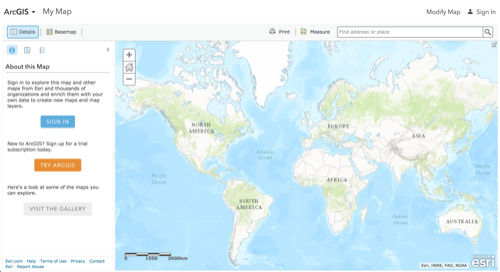

> **Note**: this page is only a draft, but this project is hosted on a [public repository](https://github.com/hhkaos/awesome-arcgis) where anyone can contribute. Learn how to [contribute in less than a minute](https://github.com/hhkaos/awesome-arcgis/blob/master/CONTRIBUTING.md#contributions).

# Web Map Viewer

The [Web Map Viewer](https://www.arcgis.com/home/webmap/viewer.html) is a web tool that allow you to create and modify [Web maps](../../../esri/open-vision/open-specifications/web-map/README.md) though a web browser. It is available on [ArcGIS Online](../arcgis-online/README.md) and [Portal for ArcGIS](../arcgis-enterprise/portal-for-arcgis/README.md).

<!-- START doctoc generated TOC please keep comment here to allow auto update -->
<!-- DON'T EDIT THIS SECTION, INSTEAD RE-RUN doctoc TO UPDATE -->
**Table of contents**

- [Introduction](#introduction)
- [Training](#training)
  - [Tutorials](#tutorials)
  - [Demos](#demos)
  - [Documentation](#documentation)
- [Build apps](#build-apps)
- [Localized resources](#localized-resources)
  - [Spanish](#spanish)

<!-- END doctoc generated TOC please keep comment here to allow auto update -->

## Introduction

You can start using the Web Map Viewer on ArcGIS Online without creating an account but if you do, you will be able to able to save what you did, perform analysis, etc.

So I recommend you to [sign up for a free account](https://developers.arcgis.com/sign-up/) and then [login in the Web Map Viewer](https://www.arcgis.com/home/webmap/viewer.html).

The Web Map Viewer is available in ArcGIS Online and in Portal for ArcGIS as you can [see here](http://server.arcgis.com/en/portal/latest/use/create-map-apps.htm).

## Training

### Tutorials

Step by step tutorials:
* [Get started with Web Map Viewer](https://learn.arcgis.com/en/projects/get-started-with-arcgis-online) (~90min)
* [Create a web map (2D)](https://developers.arcgis.com/labs/design/create-a-web-map/) (~10min)
* [Style a Web map](https://developers.arcgis.com/labs/design/style-a-web-map/)  (~10min)
* [Configure pop-ups](https://developers.arcgis.com/labs/design/configure-pop-ups/) (~5min)
* [Style your layers with smart mapping](https://developers.arcgis.com/labs/design/style-your-layers-with-smart-mapping/)  (~10min)

### Demos
  * [Load multiple variables](http://hhkaos.github.io/youtube-embed-portion/?v=gHhV44rdPBA&s=8s&e=7m09s&l=false&m=false) (7min)
  * Analysis:
    * [Aggregate data](http://odoe.net/blog/aggregate-data-arcgis-online/) (11m)
  * Smartmapping:
    * [Time based data](http://odoe.net/blog/time-based-smart-mapping-arcgis-online/) (7min)

### Documentation
* [Web Map Viewer](http://doc.arcgis.com/en/arcgis-online/create-maps/create-maps-and-apps.htm#ESRI_SECTION1_5F09915A38324AE6BD5B24368D644453)
* [Advanced search options](http://doc.arcgis.com/en/arcgis-online/reference/search.htm)
* Arcade: You can go to the [Arcade page](../../arcade/README.md) to learn how to use this expression language to create better symbolization as you can see [in this video](https://youtu.be/pmZmQlrOho8?t=3m7s).
* Viewer URL parameters for [maps](http://doc.arcgis.com/en/arcgis-online/reference/use-url-parameters.htm)
  and [embedded maps](http://doc.arcgis.com/en/arcgis-online/reference/embed-map-parameters.htm).
* [Analysis](http://doc.arcgis.com/en/arcgis-online/analyze/):
  * [Summarize data](http://doc.arcgis.com/en/arcgis-online/analyze/perform-analysis.htm#ESRI_SECTION1_B222A3C999C74BBBA717278E05279DBF)
  * [Find locations](http://doc.arcgis.com/en/arcgis-online/analyze/perform-analysis.htm#ESRI_SECTION1_60545275DD404D9F95F5BD1E7A5F42E2)
  * [Data enrichment](http://doc.arcgis.com/en/arcgis-online/analyze/perform-analysis.htm#ESRI_SECTION1_A8FF14C40E6049ADB45BA2124F5D702D)
  * [Analyze patterns](http://doc.arcgis.com/en/arcgis-online/analyze/perform-analysis.htm#ESRI_SECTION1_B36DE51FB18B4D609C65E36B37DC0C0E)
  * [Use proximity](http://doc.arcgis.com/en/arcgis-online/analyze/perform-analysis.htm#ESRI_SECTION1_2EF24808665E4E028F9AED9E438D9E9D)
  * [Manage data](http://doc.arcgis.com/en/arcgis-online/analyze/perform-analysis.htm#ESRI_SECTION1_5A5BE432AC8F46D89BD446327098ACBB)

## Build apps

After you finish your Web map you can easily create apps combining it with [configurable apps](../configurable-apps/README.md), the hosted version on ArcGIS Online or Portal of [Web AppBuilder](../web-appbuilder/README.md) and also with [AppStudio basic](../appstudio/README.md).

## Localized resources

### Spanish

* [Introducción a la interfaz de Web Map Viewer](https://www.youtube.com/watch?v=hM_-Ta_27a8)
* [Cargar un CSV con coordenadas en ArcGIS Online](https://www.youtube.com/watch?v=tHy3ecKKZTM)
* [Simbología y smart mapping en ArcGIS Online](https://www.youtube.com/watch?v=WZ0IHyOtqMk)
* [ArcGIS Web Map Viewer - WMS, WMTS, vector y tile layers](https://www.youtube.com/watch?v=UT4u0P6XTtI&feature=youtu.be)
* [Análisis de áreas de influencia](https://www.youtube.com/watch?v=vTLlRVCurtA)
* [Análisis de geoenriquecimiento](https://www.youtube.com/watch?v=MvKPced5oI8)

## Additional resources

Probably not all the resources are in this list, please use the [ArcGIS Search](https://esri-es.github.io/arcgis-search/) tool looking for: ["Web Map Viewer"](https://esri-es.github.io/arcgis-search/?search="Web Map Viewer"&utm_campaign=awesome-list&utm_source=awesome-list&utm_medium=page).

### Related products

* List of all Esri products in the ["Esri Products - ArcGIS Platform" group](https://awesome-arcgis.maps.arcgis.com/home/group.html?id=663480a878724c42aef09a523a8d5139&view=list&start=1&num=20#content

## Contributions

Feel free to improve/extend this resource page using [this template](https://github.com/hhkaos/awesome-arcgis/blob/master/templates/PRODUCT_PAGE_TEMPLATE.md) ([Contribution Guide](https://github.com/hhkaos/awesome-arcgis/blob/master/CONTRIBUTING.md)).
