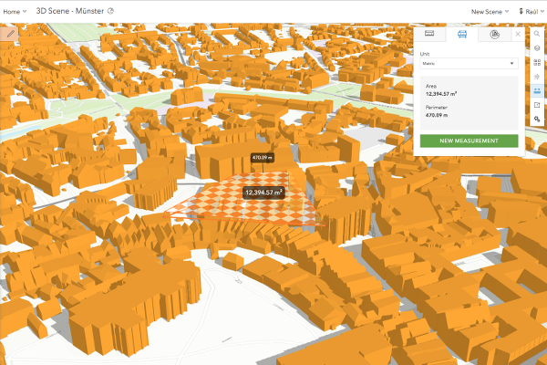

> **Note**: this page is only a draft, but this project is hosted on a [public repository](https://github.com/hhkaos/awesome-arcgis) where anyone can contribute. Learn how to [contribute in less than a minute](https://github.com/hhkaos/awesome-arcgis/blob/master/CONTRIBUTING.md#contributions).

# Web Scene Viewer

The Web Scene Viewer is a web tool that allow you to create and modify 3D Web scenes though a web browser. It is available on ArcGIS Online and ArcGIS Enterprise.

<!-- START doctoc generated TOC please keep comment here to allow auto update -->
<!-- DON'T EDIT THIS SECTION, INSTEAD RE-RUN doctoc TO UPDATE -->
**Table of contents**

- [Introduction](#introduction)
- [Training](#training)
  - [Tutorials](#tutorials)
  - [Demos](#demos)
  - [Documentation](#documentation)
  - [Examples](#examples)
- [Build apps](#build-apps)
- [Additional resources](#additional-resources)
  - [Related products or technologies](#related-products-or-technologies)
- [Contributions](#contributions)

<!-- END doctoc generated TOC please keep comment here to allow auto update -->

## Introduction

> **Disclaimer**: Although this application could be considered a product as such, you will not find any landing page on Esri.com promoting it.

The [Web Scene Viewer](https://www.esri.com/en-us/arcgis/products/3d-scene-viewer) is a web tool that allow you to create and modify [Web scenes](../../open-specifications/web-scene/README.md) though a web browser. It is available on [ArcGIS Online](../arcgis-online/README.md) and [Portal for ArcGIS](../arcgis-enterprise/portal-for-arcgis/README.md).

## Training

You can [start using the Web Map Viewer on ArcGIS Online](https://www.arcgis.com/home/webscene/viewer.html) without creating an account but if you do, you will be able to able to save what you did, perform analysis, etc.

So I recommend you to [sign up for a free account](https://developers.arcgis.com/sign-up/) and then [login in the Web Map Viewer](https://www.arcgis.com/home/webmap/viewer.html).

The Web Map Viewer is available in ArcGIS Online and in Portal for ArcGIS as you can [see here](http://server.arcgis.com/en/portal/latest/use/create-map-apps.htm).

### Tutorials

* [Get Started with the Scene Viewer](https://learn.arcgis.com/en/projects/get-started-with-the-web-scene-viewer/) (1h 20min)

### Demos
* [ArcGIS Online: Scene Basics](https://www.youtube.com/watch?v=6c2ibMlkw6k) (2min)
* [Intro to ArcGIS Scene Viewer](http://odoe.net/blog/intro-arcgis-sceneviewer/) (13min)
* [Slides in Scene Viewer](http://video.esri.com/iframe/3998/000000/width/960/0/00:00:00) (1min 30sec)
* [Add and configuring layers in the Scene Viewer](http://video.esri.com/iframe/3997/000000/width/960/0/00:00:00) (1min 14secs)
* [Vector tiles, smart mapping, 3D optimized scene layers, 3D web styles, in Web Scene Viewer](http://hhkaos.github.io/youtube-embed-portion/?v=8ebDGwBZTUI&s=14s&e=3m08s&l=false&m=false) (3m)

### Documentation

* [Get started with scenes](http://doc.arcgis.com/en/arcgis-online/get-started/get-started-with-scenes.htm)
* [View scenes in the scene viewer](http://doc.arcgis.com/en/arcgis-online/get-started/view-scenes.htm)
* [Scene viewer requirements](http://doc.arcgis.com/en/arcgis-online/reference/scene-viewer-requirements.htm)
* [Create scenes](http://doc.arcgis.com/en/arcgis-online/create-maps/choose-global-local-scene.htm)

### Examples
* [3D Web Scene gallery](http://www.arcgis.com/home/gallery.html#c=esri&t=maps&o=modified&f=scenes)

## Build apps

After you finish your Web scene you can easly create apps combining it with [configurable apps](../configurable-apps/README.md), the hosted version on ArcGIS Online or Portal of [Web AppBuilder](../web-appbuilder/README.md) and also with [AppStudio basic](../appstudio/README.md).

## Additional resources

Probably not all the resources are in this list, please use the [ArcGIS Search](https://esri-es.github.io/arcgis-search/) tool looking for: ["Web Scene Viewer"](https://esri-es.github.io/arcgis-search/?search="Web Scene Viewer"&utm_campaign=awesome-list&utm_source=awesome-list&utm_medium=page).

### Related products or technologies

List of all Esri products in the ["Esri Products - ArcGIS Platform" group](https://awesome-arcgis.maps.arcgis.com/home/group.html?id=663480a878724c42aef09a523a8d5139&view=list&start=1&num=20#content)

## Contributions

Feel free to improve/extend this resource page using [this template](https://github.com/hhkaos/awesome-arcgis/blob/master/templates/PRODUCT_PAGE_TEMPLATE.md) ([Contribution Guide](https://github.com/hhkaos/awesome-arcgis/blob/master/CONTRIBUTING.md)).
