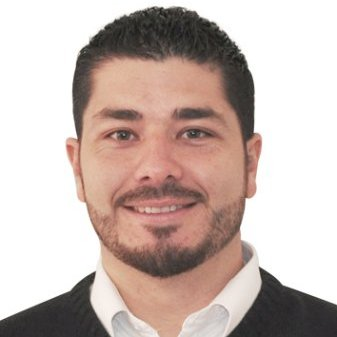

> **Note**: this page is only a draft, but this project is hosted on a [public repository](https://github.com/hhkaos/awesome-arcgis) where anyone can contribute. Learn how to [contribute in less than a minute](https://github.com/hhkaos/awesome-arcgis/blob/master/CONTRIBUTING.md#contributions).

# Community

<!-- START doctoc generated TOC please keep comment here to allow auto update -->
<!-- DON'T EDIT THIS SECTION, INSTEAD RE-RUN doctoc TO UPDATE -->
**Table of contents**

- [Introduction](#introduction)
- [Global communities](#global-communities)
  - [Early Adopter Community](#early-adopter-community)
- [Local communities](#local-communities)
  - [Colombia](#colombia)
  - [Germany](#germany)
  - [Netherlands](#netherlands)
  - [Spain](#spain)
    - [Developers](#developers)
    - [GeoMentors](#geomentors)
  - [UK](#uk)
    - [GeoMentors](#geomentors-1)
  - [USA](#usa)
- [People you should know](#people-you-should-know)

<!-- END doctoc generated TOC please keep comment here to allow auto update -->

## Introduction

What is a community?

> A common definition of community emerged as a group of people with diverse characteristics who are linked by social ties, share common perspectives, and engage in joint action in geographical locations or settings. - *Source: [ncbi.nlm.nih.gov](https://www.ncbi.nlm.nih.gov/)*

So there are many [ArcGIS](../../arcgis/README.md) users sharing content and helping each other on many channels, locations, ... Many Esri employees also participate on these communities in their spare time sharing contents, helping other users but also asking questions.

Here you will find a compilation of channels and contents.

## Global communities

The official channel maintained by Esri for the global community of ArcGIS users is [GeoNet](geonet/README.md), but there are other channel were you will find content generated by the community:

|Community channel|User type|Contents|
|---|---|---|
|[geonet.esri.com](https://geonet.esri.com/)|Any|+250K Q&A, articles, ...
|[Youtube](https://www.youtube.com/results?search_query=arcgis)|Any|+250K videos
|[gis.stackexchange.com](https://gis.stackexchange.com/)|Any|+40K Q&A
|[bit.ly/our-ideas](bit.ly/our-ideas)|Any|+13K ideas
|[StackOverflow](https://stackoverflow.com/search?q=arcgis)|Developers|+4.7K Q&A|
|[esri.com/arcgis-blog](https://www.esri.com/arcgis-blog/)|Any|+2.5K articles
|[github.com/esri](http://github.com/esri)|Developers|+1.1K Q&A

More:

* [Stackoverflow ArcGIS Top Users](https://stackoverflow.com/tags/arcgis/topusers)
* [Esri Github People](https://github.com/orgs/Esri/people)
* [Meetup related to ArcGIS](https://www.meetup.com/topics/arcgis/global/)
* [ArcGIS @ Linkedin](https://www.linkedin.com/topic/arcgis)

### Early Adopter Community

Learn more about the: [Early Adopter Community](https://www.esri.com/en-us/early-adopter)

## Local communities

There are many **initiatives for developers** running simultaneously around Esri Technologies worldwide.

### Colombia

* [GeoGeeks on Meetup](https://www.meetup.com/geogeeks/)
* [GeoGeeksCo on Facebook](https://www.facebook.com/geogeeksco/)
* [Geo_Geeks on Twitter](http://twitter.com/geo_geeks/)
* [GeoGeeks on Youtube](https://www.youtube.com/channel/UCuGsuNbUykWZ6lsb85PeW0A)
* [GeoGeeks on Colombia](https://github.com/GeoGeeks)

### Germany

* [Geo-Dev on Meetup](https://www.meetup.com/GeoDev-Germany/)
* [GeoDev Germany on GeoNet](https://community.esri.com/groups/geodev-germany/activity)
* [GeoDevGermany on Twitter](https://twitter.com/GeoDevGermany/)

### Netherlands

* [GeoNet Group](https://community.esri.com/groups/geodev-netherlands)
* [@esrinederland on Github](http://esrinederland.github.io/)

### Spain

#### Developers

[Esri Spain](http://www.esri.es/) runs most of their initiatives in Spanish and online, but sometimes they also do some in english and in person.

* [Geo-Developers on Meetup](https://www.meetup.com/Geo-Developers)
* [Geo-Developers on Slack](https://docs.google.com/forms/d/e/1FAIpQLSd18XdM62wakhQCf1yZHbvFWLr2ztM-WN1PNDdI9Hr-hx2ElQ/viewform)
* [Geo-Developers on Github](https://github.com/geo-developers)
* [Geo-Developers Website](https://geodevelopers.org)
* [GeoDevelopers on Youtube](https://www.youtube.com/GeoDevelopers)
* [@esri-es on Github](https://github.com/esri-es)
* [Developers Blog in Spanish](http://desarrolladores.esri.es)
* [GeoDev Spain at Geonet](https://community.esri.com/groups/geodev-spain)
* [geodev.slack.com](https://geodev.slack.com)

[More initiatives](https://github.com/esri-es/conferencia-usuarios/blob/master/2017/iniciativas-desarrolladores.md): Slack, etc.

#### GeoMentors

[GeoMentors](http://colegios.esri.es/geomentores/): Help teachers bring Geography to life with ArcGIS

### UK

* [GeoDev on Meetup](https://www.meetup.com/geodev/)
* [@EsriUKGeoDev on Twitter](https://twitter.com/EsriUKGeoDev/)
* [Esri UK Offical Github](https://github.com/esriuk)
* [Esri UK Map Labs](https://github.com/maplabs)

#### GeoMentors

[GeoMentors](https://schools.esriuk.com/geomentor/): Help teachers bring Geography to life with ArcGIS

### USA

* [GeoDev on Facebook](https://www.facebook.com/EsriGeoDev)
* [GeoDev on GeoNet](https://community.esri.com/groups/geodev)
* [@EsriGeoDev on Twitter](https://twitter.com/EsriGeoDev)
* [GeoDev Northeast at Meetup](https://www.meetup.com/DevMeetUpNortheast/)
* [GeoDev Northern Rockies at Meetup](https://www.meetup.com/devmeetupnorthernrockies/)
* [GeoDev Midwest at Meetup](https://www.meetup.com/DevMeetUpMidwest/)
* [GeoDev Southeast at Meetup](https://www.meetup.com/DevMeetUpSoutheast/)
* [GeoDev Pacific at Meetup](https://www.meetup.com/DevMeetUpPacific/)
* [GeoDev Arizona at Meetup](https://www.meetup.com/DevMeetUpArizona/)
* [GeoDev California at Meetup](https://www.meetup.com/DevMeetUpCalifornia/)
* [GeoDev Carolinas at Meetup](https://www.meetup.com/DevMeetupCarolinas/)
* [GeoDev Colorado at Meetup](https://www.meetup.com/devmeetupcolorado/)
* [GeoDev Oregon at Meetup](https://www.meetup.com/DevMeetUpOregon/)
* [GeoDev Texas at Meetup](https://www.meetup.com/DevMeetUpTexas/)
* [GeoDev Washington at Meetup](https://www.meetup.com/DevMeetUpWashington/)

## People you should know

You can find all the [developer advocates at github.io/arcgis-experts](https://esri-es.github.io/arcgis-experts/), but you might also want to know who is the people leading this initiatives (the **Developer Program Managers**):

|Photo|Name|Country|Twitter|Github|
|---|---|---|---|---|
||[David Martinez](https://www.linkedin.com/in/david-martinez-7682392/)|USA|[@davidjmart](https://twitter.com/davidjmart)|[dmartine](https://github.com/dmartine)
||[Sean McGee](https://www.linkedin.com/in/hertswestuk/)|UK|[@hertswestuk](https://twitter.com/hertswestuk)|[@smcgee2](https://github.com/smcgee2)
||[Raul Jimenez](https://es.linkedin.com/in/jimenezortegaraul)|Spain|[@hhkaos](https://www.twitter.com/hhkaos)|[@hhkaos](https://www.github.com/hhkaos)
||[Mark Jagt](https://www.linkedin.com/in/markjagt)|Netherlands|n.a.|[@mjagt](https://github.com/mjagt)
||[ Deiro González](https://www.linkedin.com/in/deironica/)|Colombia|[@deironica](https://twitter.com/deironica)| n.a.
||[Stephan Künster](https://www.linkedin.com/in/skuenster/)|Germany|[@skuenster](https://twitter.com/skuenster)|n.a.
||[Vijay Kumar](https://www.linkedin.com/in/vijaykumar1/?locale=en_US)|India|[@vijaysiwal](https://twitter.com/vijaysiwal)|n.a.
||Takahiro Kamiya|Japan|[@freedom_tk](https://twitter.com/freedom_tk)|n.a.
||[Kevin Escalera](https://www.linkedin.com/in/kescalera84/photo/)|Panama|[@kescalera84](https://twitter.com/kescalera84)|[@kescalera84](https://github.com/kescalera84)

<!--||[Jose Medina](http://linkedin.com/in/josemedinab)|Argentina|[@josemanuel_mb](https://twitter.com/josemanuel_mb)|n.a.-->
