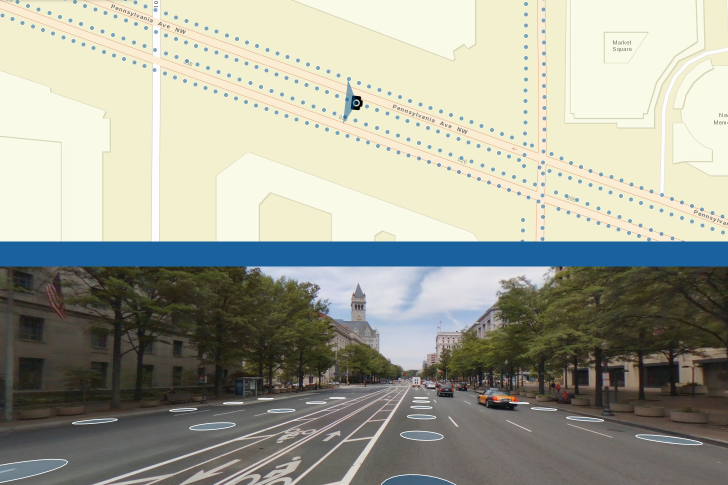

> **Note**: this page is only a draft, but this project is hosted on a [public repository](https://github.com/hhkaos/awesome-arcgis) where anyone can contribute. Learn how to [contribute in less than a minute](https://github.com/hhkaos/awesome-arcgis/blob/master/CONTRIBUTING.md#contributions).

# 360 Pictures and Videos

Panoramas or virtual tours in combination with Virtual Reality provides and inmersive way to explore GIS data.

<!-- START doctoc generated TOC please keep comment here to allow auto update -->
<!-- DON'T EDIT THIS SECTION, INSTEAD RE-RUN doctoc TO UPDATE -->
**Table of contents**

- [Introduction](#introduction)
- [Additional resources](#additional-resources)
  - [Related products](#related-products)
  - [Related technologies](#related-technologies)
  - [Other related list of resources](#other-related-list-of-resources)
- [Partners and startups](#partners-and-startups)
- [Contributions](#contributions)

<!-- END doctoc generated TOC please keep comment here to allow auto update -->

## Introduction

There are several ways to integrate a 360 image, through:

* ArcGIS API JavaScript API widgets
* Web AppBuilder widgets
* ArcGIS Desktop Add-in (ArcGIS Pro or ArcMap)
* ...

## Additional resources

Probably not all the resources are in this list, please use the [ArcGIS Search](https://esri-es.github.io/arcgis-search/) tool looking for: [360 Pictures and Videos](https://esri-es.github.io/arcgis-search/?search=360%20Pictures%20and%20Videos&utm_campaign=awesome-list&utm_source=awesome-list&utm_medium=page).

### Related products

* ArcGIS API for JS
* List of all Esri products in the ["Esri Products - ArcGIS Platform" group](https://awesome-arcgis.maps.arcgis.com/home/group.html?id=663480a878724c42aef09a523a8d5139&view=list&start=1&num=20#content)

### Related technologies

* [AR Plan 3D Ruler – Camera to Plan, Floorplanner
](https://play.google.com/store/apps/details?id=com.grymala.arplan)
* [Cupix.com](https://www.cupix.com/): Capture a space in 3D
without a 3D scanner create 3D tours and much more

### Other related list of resources

* [Indoor](../indoor/README.md)
* [Virtual reality](../vr/README.md)
* [Tour Creator](https://vr.google.com/tourcreator/) & [Expeditions](https://play.google.com/store/apps/details?id=com.google.vr.expeditions&hl=en)

## Partners and startups

Organizations and the type of relation with this product:

|Company|Relation type|Country|
|---|---|---|
|[CycloMedia](https://marketplace.arcgis.com/index.html?start=1&view=grid&sortOrder=desc&sortField=uploaded&q=cyclomedia)|Partner|USA|
|[Geograma (Orbit GT)](https://www.geograma.com/en/2017/11/09/plugin-mobile-mapping-para-arcgis/)|Partner|Spain
|[Mapillary](https://marketplace.arcgis.com/listing.html?id=baca0d2258de46f9913ff30d147b6c7b)|Partner|USA
|[Hangar](https://community.esri.com/thread/215451-hangar-joins-esri-startup-program-to-add-task-receive-aerial-insights-to-arcgis)|Startup|USA
|[FishViews](https://marketplace.arcgis.com/listing.html?id=06859768c1db4f02b32313891b0e366b)|Startup|USA

## Contributions

Feel free to improve/extend this resource page using [this template](https://github.com/hhkaos/awesome-arcgis/blob/master/templates/PRODUCT_PAGE_TEMPLATE.md) ([Contribution Guide](https://github.com/hhkaos/awesome-arcgis/blob/master/CONTRIBUTING.md)).
